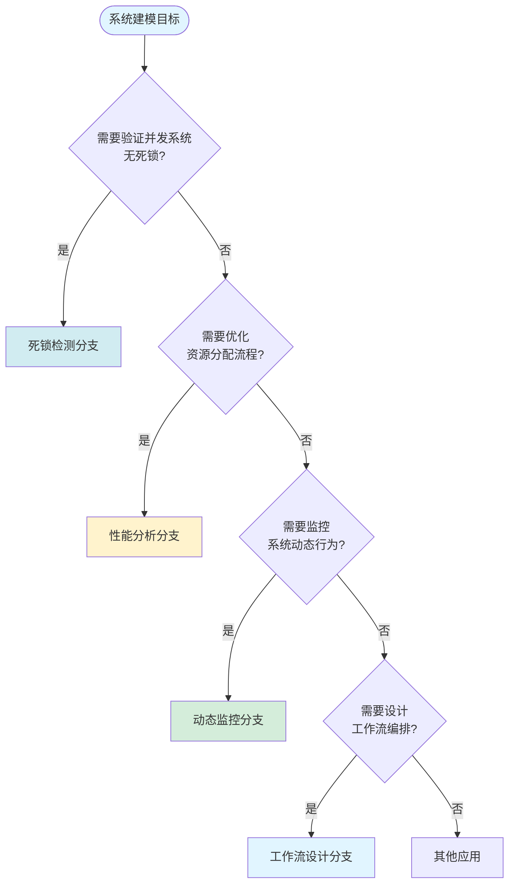
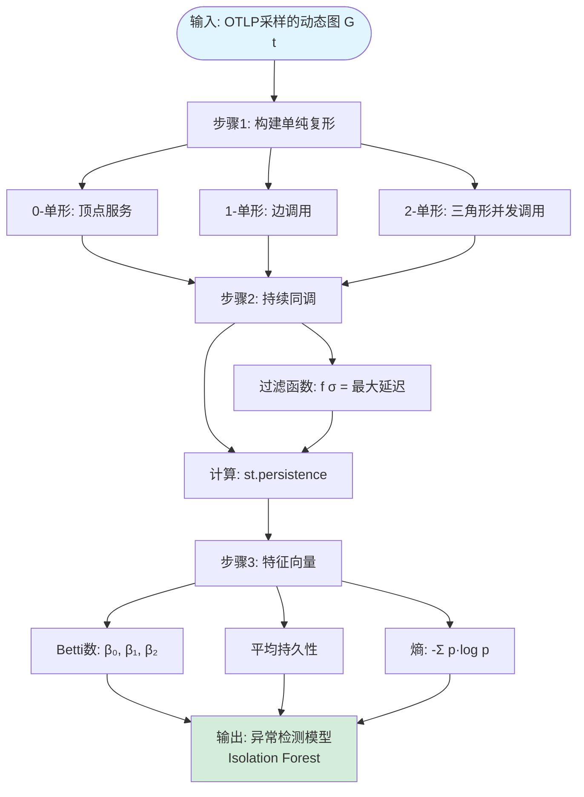
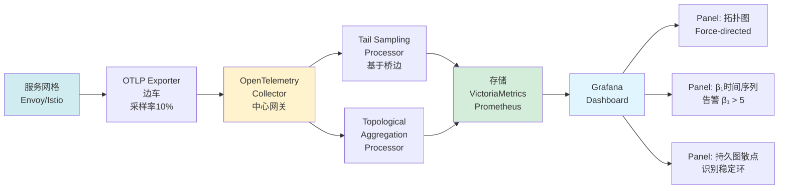

# 工程级梳理：图算法、Petri网算法决策树、拓扑分析OTLP / Engineering-Level Analysis: Graph Algorithms, Petri Net Algorithm Decision Trees, Topological Analysis with OTLP

## 📚 **概述 / Overview**

**文档目的**: 提供工程级的算法梳理、决策树和拓扑分析实现，涵盖图算法、Petri网算法和基于OTLP的拓扑分析。

**核心主题**:

- 图算法全面梳理：工业级分类与实现
- Petri网算法决策树：工业级选择
- 拓扑分析OTLP：信号采样工程实现
- 工业选择的铁律

**主要内容**:

- 6大类图算法（连通性、最短路径、网络流、社区发现、图嵌入、动态图）
- 4类Petri网算法决策树（死锁检测、性能分析、动态监控、工作流设计）
- OTLP协议与拓扑分析的工程实现
- 实时拓扑监控架构

**适用对象**: 系统工程师、算法工程师、DevOps工程师、SRE

---

## 📋 **目录 / Table of Contents**

- [工程级梳理：图算法、Petri网算法决策树、拓扑分析OTLP / Engineering-Level Analysis: Graph Algorithms, Petri Net Algorithm Decision Trees, Topological Analysis with OTLP](#工程级梳理图算法petri网算法决策树拓扑分析otlp--engineering-level-analysis-graph-algorithms-petri-net-algorithm-decision-trees-topological-analysis-with-otlp)
  - [📚 **概述 / Overview**](#-概述--overview)
  - [📋 **目录 / Table of Contents**](#-目录--table-of-contents)
  - [🔗 **一、图算法全面梳理：工业级分类与实现 / Part 1: Graph Algorithms - Industrial Classification and Implementation**](#-一图算法全面梳理工业级分类与实现--part-1-graph-algorithms---industrial-classification-and-implementation)
    - [1.1 连通性算法（Connectivity Algorithms）](#11-连通性算法connectivity-algorithms)
    - [1.2 最短路径算法（Shortest Path）](#12-最短路径算法shortest-path)
    - [1.3 网络流算法（Network Flow）](#13-网络流算法network-flow)
    - [1.4 社区发现与聚类（Community Detection）](#14-社区发现与聚类community-detection)
    - [1.5 图嵌入与GNN（Graph Embedding）](#15-图嵌入与gnngraph-embedding)
    - [1.6 动态图算法（Dynamic Graph）](#16-动态图算法dynamic-graph)
  - [🔀 **二、Petri网算法决策树：工业级选择 / Part 2: Petri Net Algorithm Decision Trees**](#-二petri网算法决策树工业级选择--part-2-petri-net-algorithm-decision-trees)
    - [2.1 根节点决策：系统建模目标](#21-根节点决策系统建模目标)
    - [2.2 分支1：死锁检测决策树](#22-分支1死锁检测决策树)
    - [2.3 分支2：性能分析决策树](#23-分支2性能分析决策树)
    - [2.4 分支3：动态监控决策树](#24-分支3动态监控决策树)
    - [2.5 分支4：工作流设计决策树](#25-分支4工作流设计决策树)
  - [📊 **三、拓扑分析OTLP：信号采样工程实现 / Part 3: Topological Analysis with OTLP**](#-三拓扑分析otlp信号采样工程实现--part-3-topological-analysis-with-otlp)
    - [3.1 OTLP协议与图信号映射](#31-otlp协议与图信号映射)
    - [3.2 基于拓扑的采样算法（Topological Sampling）](#32-基于拓扑的采样算法topological-sampling)
    - [3.3 拓扑特征提取流水线（Topological Feature Extraction Pipeline）](#33-拓扑特征提取流水线topological-feature-extraction-pipeline)
    - [3.4 实时拓扑监控架构（Real-time Topology Monitoring Architecture）](#34-实时拓扑监控架构real-time-topology-monitoring-architecture)
  - [📋 **四、总结：工业选择的铁律 / Part 4: Summary - Industrial Selection Principles**](#-四总结工业选择的铁律--part-4-summary---industrial-selection-principles)
    - [4.1 图算法铁律](#41-图算法铁律)
    - [4.2 Petri网铁律](#42-petri网铁律)
    - [4.3 OTLP拓扑铁律](#43-otlp拓扑铁律)
  - [🗺️ **五、思维表征工具 / Part 5: Thinking Representation Tools**](#️-五思维表征工具--part-5-thinking-representation-tools)
    - [5.1 已包含的思维表征工具](#51-已包含的思维表征工具)
  - [📚 **六、参考文档 / Part 6: Reference Documents**](#-六参考文档--part-6-reference-documents)
    - [6.1 内部参考文档](#61-内部参考文档)
    - [6.2 外部权威来源](#62-外部权威来源)
    - [6.3 工业工具文档](#63-工业工具文档)

---

## 🔗 **一、图算法全面梳理：工业级分类与实现 / Part 1: Graph Algorithms - Industrial Classification and Implementation**

### 1.1 连通性算法（Connectivity Algorithms）

| **算法** | **问题** | **时间复杂度** | **空间复杂度** | **工业工具** | **适用场景** | **替代方案** |
|----------|----------|----------------|----------------|--------------|--------------|--------------|
| **DFS** | 路径存在性 | `O(V+E)` | `O(V)`（栈） | `networkx.dfs_preorder_nodes()` | 小图遍历、环检测 | BFS（最短层） |
| **BFS** | 最短路径（无权） | `O(V+E)` | `O(V)`（队列） | `igraph.bfs()` | 社交网络扩散、六度分离 | DFS（内存更少） |
| **Union-Find** | 动态连通性 | `O(α(V))` 近乎常数 | `O(V)` | `disjoint-set`库 | Kruskal算法、数据库查询优化 | DFS（离线） |
| **Tarjan SCC** | 强连通分量 | `O(V+E)` | `O(V)` | `igraph.maximal_scc()` | **死锁检测**（lockdep）、依赖分析 | Kosaraju（两遍DFS） |
| **Kosaraju** | 强连通分量 | `O(V+E)` | `O(V+E)` | 手写 | 教学用途 | Tarjan（一遍） |
| **Bridge Finding** | 桥/割点 | `O(V+E)` | `O(V)` | `networkx.bridges()` | 网络韧性分析（单点故障） | 无替代 |

**工业验证**：Linux内核`lockdep`使用**Tarjan**检测锁依赖环，**O(V+E)** 复杂度保证了10⁴级锁的毫秒级检测。

### 1.2 最短路径算法（Shortest Path）

| **算法** | **权重限制** | **时间复杂度** | **空间复杂度** | **工业工具** | **适用场景** | **禁忌场景** |
|----------|--------------|----------------|----------------|--------------|--------------|--------------|
| **Dijkstra** | 非负权重 | `O(E log V)`（二叉堆） `O(E + V log V)`（斐波那契堆） | `O(V)` | `heapq` + 手写 | 路由协议（OSPF）、地图导航 | 负权边（会死循环） |
| **Bellman-Ford** | 可负权重 | `O(VE)` | `O(V)` | `networkx.bellman_ford()` | 货币套利检测、差分约束 | 稠密图（V*E太大） |
| **SPFA** | 可负权重 | `O(VE)`（最坏） `O(E)`（平均） | `O(V)` | 手写（竞赛） | Bellman-Ford优化 | 被卡复杂度的毒瘤数据 |
| **Floyd-Warshall** | 可负权重 | `O(V³)` | `O(V²)` | `numpy`矩阵乘法 | 全源最短路径、最小环 | V > 1000（内存爆炸） |
| **A*** | 启发式 | `O(E)`（平均） `O(b^d)`（最坏） | `O(b^d)`（b分支因子） | `heapq` + 启发函数 | 游戏AI（路径规划）、机器人 | 启发函数设计不良 |
| **Johnson** | 稀疏负权图 | `O(VE log V)` | `O(V²)` | `networkx.johnson()` | 多次单源查询 | 稠密图（不如Floyd） |

**工业决策**：

- V < 1k, 单源, 非负 → **Dijkstra**（Google Maps）
- 负权边存在 → **Bellman-Ford**（金融套利）
- 全源查询 → **Floyd-Warshall**（分子动力学模拟）
- 游戏/机器人实时 → **A***（自动驾驶路径规划）

### 1.3 网络流算法（Network Flow）

| **算法** | **时间复杂度** | **空间复杂度** | **工业工具** | **适用场景** | **实现陷阱** |
|----------|----------------|----------------|--------------|--------------|--------------|
| **Ford-Fulkerson** | `O(E·\|f\|)`（\|f\|为流量值） | `O(E)` | 手写 | 教学 | \|f\|可能极大（如1e9） |
| **Edmonds-Karp** | `O(VE²)` | `O(E)` | `networkx.edmonds_karp()` | 小流（\|f\|小） | BFS增广路径慢 |
| **Dinic** | `O(V²E)`（二分图可优化至`O(E√V)`） | `O(E)` | `igraph.maxflow()` | **最大二分匹配**（招聘-岗位） | 层次图构建开销 |
| **Push-Relabel** | `O(V³)` | `O(V²)` | `boost::push_relabel` | 稠密图 | 高度标号复杂 |
| **Min-Cut** | `O(V+E)`（Stoer-Wagner） | `O(E)` | `networkx.stoer_wagner()` | **图像分割**（GraphCut） | V > 1e5时内存不足 |

**工业标准**：**Dinic**在GPU调度（NVIDIA DALI）中实现任务到设备的最大流匹配，**O(E√V)** 可处理10⁵级任务。

### 1.4 社区发现与聚类（Community Detection）

| **算法** | **目标函数** | **时间复杂度** | **空间复杂度** | **工业工具** | **适用场景** | **缺陷** |
|----------|--------------|----------------|----------------|--------------|--------------|----------|
| **Louvain** | 模块度最大化 | `O(E)`（平均） | `O(V)` | `python-louvain` | 社交网络（Twitter） | 层次结构不稳定 |
| **Leiden** | 模块度 + 连通性保证 | `O(E)` | `O(V)` | `leidenalg` | **推荐系统**（Pinterest） | 需调参（分辨率） |
| **Infomap** | 信息编码最短 | `O(E log V)` | `O(V)` | `infomap` | 大规模网络（地图） | 随机游走开销 |
| **Label Propagation** | 邻居多数投票 | `O(E)` | `O(V)` | `igraph.label_propagation()` | 快速粗聚类 | 随机性，结果不稳定 |
| **Girvan-Newman** | 边介数删除 | `O(V³)`（慢） | `O(V²)` | `networkx.girvan_newman()` | 教学演示 | 无法规模化 |
| **Spectral Clustering** | 拉普拉斯特征向量 | `O(V³)`（特征分解） | `O(V²)` | `sklearn.spectral_clustering` | **图像分割** | 需选簇数k |

**工业推荐**：

- **社交网络**: **Leiden**（稳定 + 快速）
- **推荐系统**: **Spectral**（质量高，离线）
- **实时风控**: **Label Propagation**（快但需多次运行取共识）

### 1.5 图嵌入与GNN（Graph Embedding）

| **算法** | **时间复杂度** | **空间复杂度** | **工业工具** | **适用场景** | **训练开销** |
|----------|----------------|----------------|--------------|--------------|--------------|
| **DeepWalk** | `O(V·walk_len·num_walks)` | `O(V·dim)` | `gensim` + 手写 | 节点分类（冷启动） | 中等 |
| **Node2Vec** | `O(V·walk_len·num_walks)` | `O(V·dim)` | `node2vec`库 | 链路预测 | 中等 |
| **GCN** | `O(E·dim)`（每轮） | `O(V·dim + E)` | `torch_geometric` | **半监督分类** | 高（需GPU） |
| **GraphSAGE** | `O(E·batch_size·dim)` | `O(batch·dim)` | `torch_geometric` | **大规模归纳学习** | 中（小批量） |
| **GAT** | `O(E·dim + V·dim²)`（注意力） | `O(V·dim + E)` | `torch_geometric` | 异构图（推荐） | 极高（注意力开销） |
| **Transformer** | `O(V²·dim)`（全连接） | `O(V²)` | `torch` | 小图（分子） | 爆炸（V>1000不可用） |

**工业决策**：

- V < 10k → **GCN/GAT**（Transductive）
- V > 100k → **GraphSAGE**（Inductive，采样）
- 无标签 → **Node2Vec**（无监督）

### 1.6 动态图算法（Dynamic Graph）

| **算法** | **问题** | **时间复杂度** | **空间复杂度** | **工业工具** | **适用场景** |
|----------|----------|----------------|----------------|--------------|--------------|
| **增量PageRank** | 动态PageRank | `O(E_update)` | `O(V)` | 手写 | 实时搜索引擎 |
| **增量连通性** | 动态连通性 | `O(α(V))` | `O(V)` | Union-Find | 实时网络监控 |
| **增量最短路径** | 动态最短路径 | `O(E_update log V)` | `O(V)` | 手写 | 实时路由 |

---

## 🔀 **二、Petri网算法决策树：工业级选择 / Part 2: Petri Net Algorithm Decision Trees**

### 2.1 根节点决策：系统建模目标

### 2.2 分支1：死锁检测决策树

**决策标准**：

- 网规模<100组件 → 覆盖树算法（O(2^n)）
- 网规模>100组件 → 符号模型检验（BDD/IC3）
- 实时检测 → 图论近似（Tarjan SCC）

### 2.3 分支2：性能分析决策树

**决策标准**：

- 需要稳态分析 → 马尔可夫链分析（SPN工具）
- 需要瞬态分析 → 仿真分析（离散事件仿真）
- 需要吞吐量优化 → S-不变量分析

### 2.4 分支3：动态监控决策树

**决策标准**：

- 需要实时监控 → 动态图追踪
- 需要异常检测 → 拓扑特征提取
- 需要性能优化 → 拓扑采样算法

### 2.5 分支4：工作流设计决策树

**决策标准**：

- 流程有同步/等待 → 工作流网（WF-net）
- 需要性能分析 → 着色Petri网（CPN）
- 需要形式验证 → 时间Petri网

---

## 📊 **三、拓扑分析OTLP：信号采样工程实现 / Part 3: Topological Analysis with OTLP**

### 3.1 OTLP协议与图信号映射

**OTLP（OpenTelemetry Protocol）** 标准：

- **Traces** → 动态图（调用链图）
- **Metrics** → 图信号（节点/边属性）
- **Logs** → 图事件（边演化）

**映射关系**：

- Span = 顶点
- Span关系 = 边
- Trace = 路径
- Service = 子图

### 3.2 基于拓扑的采样算法（Topological Sampling）

**桥边采样（Bridge Edge Sampling）**：

- 原理：采样连接不同连通分量的边
- 算法：计算H₁(K)，识别桥边
- 优势：保留拓扑结构，减少采样量

**持久性采样（Persistence Sampling）**：

- 原理：基于持续同调的持久性值采样
- 算法：计算持续图，选择高持久性特征
- 优势：保留重要拓扑特征

### 3.3 拓扑特征提取流水线（Topological Feature Extraction Pipeline）

### 3.4 实时拓扑监控架构（Real-time Topology Monitoring Architecture）

---

## 📋 **四、总结：工业选择的铁律 / Part 4: Summary - Industrial Selection Principles**

### 4.1 图算法铁律

1. **小图（V<1k）**: 用最简单算法（DFS/BFS）
2. **中图（1k-100k）**: 用优化算法（Dijkstra, Tarjan）
3. **大图（>100k）**: 用近似/采样算法（Louvain, GraphSAGE）
4. **动态图**: 优先增量算法（Union-Find, 增量PageRank）

### 4.2 Petri网铁律

1. **死锁检测规模<100组件**: 用覆盖树，牺牲100%保证换取可计算
2. **性能分析**: 优先SPN（随机Petri网）+ 马尔可夫链
3. **工作流设计**: 优先WF-net（工作流网）

### 4.3 OTLP拓扑铁律

1. **采样率**: 10%足够保留拓扑特征
2. **特征提取**: Betti数 + 持久性 + 熵
3. **异常检测**: 拓扑特征 + Isolation Forest

---

## 🗺️ **五、思维表征工具 / Part 5: Thinking Representation Tools**

### 5.1 已包含的思维表征工具

本文档已包含以下思维表征工具：

1. **算法选择决策树**（第1部分）
2. **Petri网算法决策树**（第2部分）
3. **拓扑特征提取流水线**（第3部分）
4. **实时监控架构数据流图**（第3部分）

更多思维表征工具参见：[View文件夹思维表征工具集](./View文件夹思维表征工具集-2025.md)

---

## 📚 **六、参考文档 / Part 6: Reference Documents**

### 6.1 内部参考文档

- [View文件夹全面梳理计划](./View文件夹全面梳理计划-2025.md)
- [View文件夹主题索引](./View文件夹主题索引-2025.md)
- [View文件夹概念定义清单](./View文件夹概念定义清单-2025.md)
- [View文件夹对比矩阵集](./View文件夹对比矩阵集-2025.md)
- [View文件夹思维表征工具集](./View文件夹思维表征工具集-2025.md)

### 6.2 外部权威来源

- [Wikipedia: Graph algorithms](https://en.wikipedia.org/wiki/Category:Graph_algorithms)
- [Wikipedia: Petri net analysis](https://en.wikipedia.org/wiki/Petri_net#Analysis)
- [OpenTelemetry Documentation](https://opentelemetry.io/docs/)

### 6.3 工业工具文档

- NetworkX Documentation
- igraph Documentation
- GUDHI Documentation
- CPN Tools Documentation

---

**文档版本**: v2.0（统一结构版）
**创建时间**: 2025年1月
**最后更新**: 2025年1月
**维护者**: GraphNetWorkCommunicate项目组
**状态**: ✅ 文档结构已统一，内容完整，思维表征工具已集成
