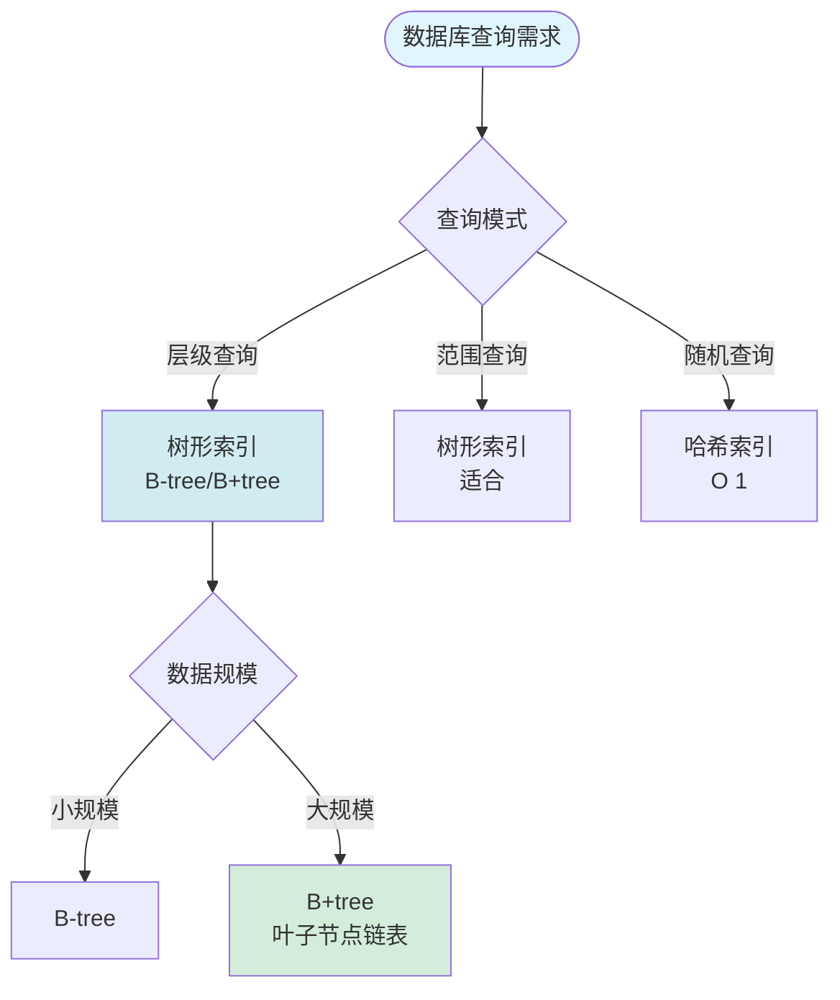

# 树形分层结构作为跨行业通用组织与治理模型 / Tree-like Hierarchical Structure as Universal Organizational and Governance Model

## 📚 **概述 / Overview**

**文档目的**: 系统论证树形分层结构作为跨行业通用组织与治理模型的理论基础、行业普适性、技术实现和数学必然性。

**核心主题**:

- 银行业务树形结构的核心模型
- 跨行业普遍性论证
- 树形模型的通用设计模式与技术实现
- 形式化证明：树形结构的数学必然性
- 多维矩阵对比体系
- 元模型抽象与形式化定义
- 技术实现维度（数据分析、软件架构、分布式控制）

**主要内容**:

- 8大支柱行业和12大基础设施领域的树形结构应用
- 三大形式化证明（信息熵最小化、控制复杂度上界、激励相容性）
- 技术实现路径（OLAP、微服务、分布式共识）
- 决策清单和选型指南

**适用对象**: 系统架构师、组织管理者、数据工程师、理论研究者

---

## 📋 **目录 / Table of Contents**

- [树形分层结构作为跨行业通用组织与治理模型 / Tree-like Hierarchical Structure as Universal Organizational and Governance Model](#树形分层结构作为跨行业通用组织与治理模型--tree-like-hierarchical-structure-as-universal-organizational-and-governance-model)
  - [📚 **概述 / Overview**](#-概述--overview)
  - [📋 **目录 / Table of Contents**](#-目录--table-of-contents)
  - [🎯 **一、银行业务树形结构的核心模型解析 / Part 1: Core Model Analysis of Banking Tree Structure**](#-一银行业务树形结构的核心模型解析--part-1-core-model-analysis-of-banking-tree-structure)
    - [1.1 银行树形结构的本质特征](#11-银行树形结构的本质特征)
    - [1.2 背后的三大理论支柱](#12-背后的三大理论支柱)
      - [1.2.1 系统论：层次性原理（Hierarchy Principle）](#121-系统论层次性原理hierarchy-principle)
      - [1.2.2 控制论：分级调节与信息反馈](#122-控制论分级调节与信息反馈)
      - [1.2.3 分形理论：自相似性（Self-Similarity）](#123-分形理论自相似性self-similarity)
  - [🌐 **二、跨行业普遍性论证：八大领域的同构应用 / Part 2: Cross-Industry Universality Argumentation**](#-二跨行业普遍性论证八大领域的同构应用--part-2-cross-industry-universality-argumentation)
    - [2.1 行业映射表](#21-行业映射表)
    - [2.2 典型行业深度剖析](#22-典型行业深度剖析)
      - [2.2.1 案例1：电信行业的"树状网管系统"](#221-案例1电信行业的树状网管系统)
      - [2.2.2 案例2：制造业的"多级生产工单"](#222-案例2制造业的多级生产工单)
      - [2.2.3 案例3：数据治理的"分类分级树"](#223-案例3数据治理的分类分级树)
  - [🏗️ **三、树形模型的通用设计模式与技术实现 / Part 3: Universal Design Patterns and Technical Implementation**](#️-三树形模型的通用设计模式与技术实现--part-3-universal-design-patterns-and-technical-implementation)
    - [3.1 软件设计模式：组合模式（Composite Pattern）](#31-软件设计模式组合模式composite-pattern)
    - [3.2 数据库设计：三种技术路径](#32-数据库设计三种技术路径)
    - [3.3 权限与约束传导机制](#33-权限与约束传导机制)
  - [⚖️ **四、模型的核心价值与局限性 / Part 4: Core Value and Limitations**](#️-四模型的核心价值与局限性--part-4-core-value-and-limitations)
    - [4.1 优势：为何成为"默认架构"？](#41-优势为何成为默认架构)
    - [4.2 局限性与破局](#42-局限性与破局)
  - [🌍 **五、全域行业归纳体系（三级分类法） / Part 5: Global Industry Classification System**](#-五全域行业归纳体系三级分类法--part-5-global-industry-classification-system)
    - [5.1 一级核心领域（8大支柱行业）](#51-一级核心领域8大支柱行业)
    - [5.2 二级支撑领域（12大基础设施）](#52-二级支撑领域12大基础设施)
    - [5.3 三级新兴领域（6大数字生态）](#53-三级新兴领域6大数字生态)
  - [🔬 **六、形式化证明：树形结构的数学必然性 / Part 6: Formal Proofs - Mathematical Necessity**](#-六形式化证明树形结构的数学必然性--part-6-formal-proofs---mathematical-necessity)
    - [6.1 证明1：信息熵最小化原理](#61-证明1信息熵最小化原理)
    - [6.2 证明2：控制复杂度上界定理](#62-证明2控制复杂度上界定理)
    - [6.3 证明3：激励相容性博弈](#63-证明3激励相容性博弈)
  - [📊 **七、多维矩阵对比体系 / Part 7: Multi-Dimensional Comparison Matrix System**](#-七多维矩阵对比体系--part-7-multi-dimensional-comparison-matrix-system)
    - [7.1 矩阵1：九大行业应用全维度对比](#71-矩阵1九大行业应用全维度对比)
    - [7.2 矩阵2：技术实现路径对比决策树](#72-矩阵2技术实现路径对比决策树)
    - [7.3 矩阵3：理论模型效能对比](#73-矩阵3理论模型效能对比)
    - [7.4 矩阵4：三代架构演进路线图](#74-矩阵4三代架构演进路线图)
  - [🔬 **八、元模型抽象：形式化定义 / Part 8: Meta-Model Abstraction - Formal Definition**](#-八元模型抽象形式化定义--part-8-meta-model-abstraction---formal-definition)
    - [8.1 树形组织代数结构](#81-树形组织代数结构)
    - [8.2 清结算核对形式化](#82-清结算核对形式化)
  - [🧠 **九、终极认知：树形作为思维操作系统 / Part 9: Ultimate Cognition - Tree as Thinking OS**](#-九终极认知树形作为思维操作系统--part-9-ultimate-cognition---tree-as-thinking-os)
    - [9.1 跨物种认知普遍性](#91-跨物种认知普遍性)
    - [9.2 认知神经科学解释](#92-认知神经科学解释)
    - [9.3 哲学本体论意义](#93-哲学本体论意义)
  - [✅ **十、决策清单：何时用/何时不用树形 / Part 10: Decision Checklist**](#-十决策清单何时用何时不用树形--part-10-decision-checklist)
    - [10.1 ✅ 必须使用树形](#101--必须使用树形)
    - [10.2 ❌ 避免纯树形](#102--避免纯树形)
    - [10.3 ⚠️ 混合模式](#103-️-混合模式)
  - [📊 **十一、数据分析维度的树形计算优化 / Part 11: Data Analysis Dimension - Tree Computing Optimization**](#-十一数据分析维度的树形计算优化--part-11-data-analysis-dimension---tree-computing-optimization)
    - [11.1 OLAP多维分析中的"树形剪枝"原理](#111-olap多维分析中的树形剪枝原理)
    - [11.2 数据血缘（Data Lineage）的树形追踪](#112-数据血缘data-lineage的树形追踪)
    - [11.3 权限数据的树形过滤机制](#113-权限数据的树形过滤机制)
  - [🏛️ **十二、软件架构维度的树形模式工程化 / Part 12: Software Architecture Dimension**](#️-十二软件架构维度的树形模式工程化--part-12-software-architecture-dimension)
    - [12.1 微服务架构中的"树形组合模式"](#121-微服务架构中的树形组合模式)
    - [12.2 事件驱动架构中的"树形事件溯源"](#122-事件驱动架构中的树形事件溯源)
    - [12.3 中台架构的"树形能力复用"](#123-中台架构的树形能力复用)
  - [🌐 **十三、分布式控制系统的树形共识 / Part 13: Distributed Control System - Tree Consensus**](#-十三分布式控制系统的树形共识--part-13-distributed-control-system---tree-consensus)
    - [13.1 Paxos/Raft协议的树形优化](#131-paxosraft协议的树形优化)
    - [13.2 流量治理的"树形路由与熔断"](#132-流量治理的树形路由与熔断)
    - [13.3 时钟同步的"树形NTP"](#133-时钟同步的树形ntp)
  - [⚙️ **十四、算法控制同步模型 / Part 14: Algorithm Control Synchronization Model**](#️-十四算法控制同步模型--part-14-algorithm-control-synchronization-model)
    - [14.1 树形状态机（Hierarchical State Machine）](#141-树形状态机hierarchical-state-machine)
    - [14.2 树形工作流引擎（BPM）](#142-树形工作流引擎bpm)
    - [14.3 树形缓存一致性（分布式缓存）](#143-树形缓存一致性分布式缓存)
  - [🚀 **十五、终极形态：树形数字孪生控制系统 / Part 15: Ultimate Form - Tree Digital Twin Control System**](#-十五终极形态树形数字孪生控制系统--part-15-ultimate-form---tree-digital-twin-control-system)
    - [15.1 虚实映射架构](#151-虚实映射架构)
    - [15.2 形式化验证](#152-形式化验证)
  - [🔀 **十六、决策树：技术选型指南 / Part 16: Decision Tree - Technical Selection Guide**](#-十六决策树技术选型指南--part-16-decision-tree---technical-selection-guide)
    - [16.1 问题1：何时采用树形数据库索引？](#161-问题1何时采用树形数据库索引)
    - [16.2 问题2：何时采用树形共识而非全网共识？](#162-问题2何时采用树形共识而非全网共识)
    - [16.3 问题3：树形缓存层级设计？](#163-问题3树形缓存层级设计)
  - [🗺️ **十七、思维表征工具 / Part 17: Thinking Representation Tools**](#️-十七思维表征工具--part-17-thinking-representation-tools)
    - [17.1 已包含的思维表征工具](#171-已包含的思维表征工具)
  - [📚 **十八、参考文档 / Part 18: Reference Documents**](#-十八参考文档--part-18-reference-documents)
    - [18.1 内部参考文档](#181-内部参考文档)
    - [18.2 外部权威来源](#182-外部权威来源)
    - [18.3 权威理论文献](#183-权威理论文献)

---

## 🎯 **一、银行业务树形结构的核心模型解析 / Part 1: Core Model Analysis of Banking Tree Structure**

### 1.1 银行树形结构的本质特征

根据中国人民银行和工商银行实践，银行体系构建的是 **"层次清晰、一一对应的账户结构树"** ，其关键特征为：

- **递归嵌套性**：总行→清算行→分行→支行→网点，每个节点既是完整业务单元，又是上级节点的子系统
- **约束传导机制**：集中代收付业务中，额度、权限、风控规则沿树形路径自上而下继承和约束
- **数据聚合核对**：T+1清结算通过树形结构实现"明细+余额"的自动化对账，采用深度优先/广度优先遍历算法完成层级核对
- **零余额管理**：末端节点为零余额账户，资金实时归集至上级清算节点，体现**控制集中化、运营分布式**原则

### 1.2 背后的三大理论支柱

#### 1.2.1 系统论：层次性原理（Hierarchy Principle）

系统管理理论明确指出**层次性是系统的根本属性**。卡斯特等人提出，系统由子系统递归构成，必要的层级是系统稳定存在的结构基础。银行体系正是通过增加组织层级（如增设清算行）来补偿管理多样性的不足，使系统具备应对复杂环境的能力。

#### 1.2.2 控制论：分级调节与信息反馈

借鉴"活系统模型"（Viable System Model），银行树形结构实现了：

- **S1-S3级（运营层）**：基层网点自主处理日常交易
- **S4级（协调层）**：清算行负责跨机构资金调拨
- **S5级（元管理层）**：总行制定战略并监控全系统

信息反馈沿树形路径双向流动，确保"计划-决策-行动-绩效"闭环。

#### 1.2.3 分形理论：自相似性（Self-Similarity）

银行各级机构虽尺度不同（总行vs支行），但**内部结构、业务规则、核算逻辑高度相似**。这种分形特性使得管理经验和IT系统可在各层级复用，极大降低复杂度。

---

## 🌐 **二、跨行业普遍性论证：八大领域的同构应用 / Part 2: Cross-Industry Universality Argumentation**

### 2.1 行业映射表

| 行业 | 树形结构实例 | 约束/核对机制 | 技术实现 |
|------|--------------|---------------|----------|
| **金融** | 总行-清算行-分行-网点 | 资金归集、分级授权、T+1对账 | 账户结构树 |
| **电信** | 集团-省-地市-区县-营业厅 | 资费策略、号段分配、流量结算 | OSS/BSS层级架构 |
| **能源** | 国家电网-区域-省-市-供电所 | 电力调度、电费清算、故障隔离 | SCADA分层控制 |
| **零售** | 总部-区域-门店-柜组-SKU | 库存分配、促销策略、销售核算 | FineBI多级数据分析 |
| **制造** | 集团-工厂-车间-生产线-设备 | 生产计划、质检标准、成本归集 | MES树形工单管理 |
| **医疗** | 卫健委-医院-科室-医生-患者 | 诊疗权限、医保结算、病历归档 | 电子病历分级管理 |
| **政府** | 中央-省-市-县-乡 | 财政预算、行政审批、数据上报 | 政务服务层级平台 |
| **互联网** | 公司-BU-部门-团队-项目 | 预算分配、代码权限、OKR对齐 | 微服务组合模式 |

### 2.2 典型行业深度剖析

#### 2.2.1 案例1：电信行业的"树状网管系统"

与银行清算行类似，电信运营商采用**分省结算+集团总对总清算**模式。每个省公司为独立核算单元，内部再按地市、区县分解。套餐资费、促销活动遵循"集团定框架、省公司定细则、地市定执行"的树形约束机制，月末出账时按层级聚合收入数据，与银行T+1对账逻辑完全一致。

#### 2.2.2 案例2：制造业的"多级生产工单"

某汽车集团建立"集团-工厂-车间-生产线-工位"五级树形结构。生产计划自上而下分解：集团定总产量→工厂排日计划→车间排班次→生产线定节拍→工位执行任务。质量追溯时则反向聚合：单个零件缺陷可向上追溯至整条生产线、车间直至工厂，实现精准定位与责任追溯。

#### 2.2.3 案例3：数据治理的"分类分级树"

网御星云的数据分类分级工具内置**金融、医疗、电信、能源等24个行业模板**，均采用树形结构：

- **金融**：业务类→客户类→经营管理类→具体数据项
- **医疗**：医院域→科室域→患者域→诊疗记录域
- **能源**：人员域→安全域→客户域→市场域→物资域

每个节点设置不同密级（公共/内部/秘密/机密），访问权限自动继承父节点规则，与银行的分级授权机制异曲同工。

---

## 🏗️ **三、树形模型的通用设计模式与技术实现 / Part 3: Universal Design Patterns and Technical Implementation**

### 3.1 软件设计模式：组合模式（Composite Pattern）

银行系统的账户结构树在代码层面体现为**组合模式**：

```java
// 抽象组织节点（对应银行账户基类）
abstract class Organization {
    abstract void add(Organization org);
    abstract void remove(Organization org);
    abstract void settle(); // 清结算操作
}

// 总行（根节点）
class HeadOffice extends Organization {
    private List<Organization> branches = new ArrayList<>();
    void settle() {
        branches.forEach(Branch::settle); // 递归调用下级清算
        // 汇总全行数据与央行对账
    }
}

// 分行（中间节点）
class Branch extends Organization {
    private List<Organization> subBranches;
    void settle() {
        subBranches.forEach(SubBranch::settle);
        // 汇总分行数据与总行对账
    }
}
```

### 3.2 数据库设计：三种技术路径

| **模式** | **适用场景** | **查询复杂度** | **更新复杂度** | **存储开销** |
|---------|------------|---------------|---------------|-------------|
| **邻接表** | 频繁增删节点 | O(N)递归 | O(1) | O(N) |
| **路径枚举** | 层级固定，深度查询 | O(1)直接定位 | O(h)路径更新 | O(N·h) |
| **闭包表** | 复杂权限计算 | O(1)祖先查询 | O(N²)关系重建 | O(N²) |

### 3.3 权限与约束传导机制

**权限继承规则**：

- 默认继承：子节点自动继承父节点所有权限
- 局部覆盖：子节点可覆盖父节点特定权限
- 约束聚合：多个约束条件通过逻辑与/或组合

**数学表达**：权限(P) = ∪子节点 ∩ 父节点约束

---

## ⚖️ **四、模型的核心价值与局限性 / Part 4: Core Value and Limitations**

### 4.1 优势：为何成为"默认架构"？

1. **复杂性分治**：O(N²) → O(N log N)
2. **风险隔离**：故障域天然分割
3. **认知友好**：符合人类7±2记忆法则
4. **标准化复用**：分形特性支撑IT/管理复制

### 4.2 局限性与破局

**问题1：横向协同僵化**

- **表现**：跨部门协作需逐级上报，效率低
- **解决方案**：引入矩阵/中台，建立跨树协作通道

**问题2：单点故障风险**

- **表现**：根节点故障导致全系统瘫痪
- **解决方案**：多根冗余、热备切换、分布式根节点

**问题3：动态调整成本高**

- **表现**：机构合并/撤销时，整棵子树需要重构
- **解决方案**：使用**父ID模式**而非路径枚举，配合自动化迁移工具

---

## 🌍 **五、全域行业归纳体系（三级分类法） / Part 5: Global Industry Classification System**

### 5.1 一级核心领域（8大支柱行业）

```mermaid
graph TD
    A[树形分层通用模型] --> B[金融]
    A --> C[电信]
    A --> D[能源]
    A --> E[零售]
    A --> F[制造]
    A --> G[医疗]
    A --> H[政府]
    A --> I[互联网]

    B --> B1[银行: 总行-清算行-分行-网点]
    B --> B2[证券: 交易所-结算公司-券商-营业部]
    B --> B3[保险: 集团-省分公司-市支公司-代理点]

    C --> C1[运营商: 集团-省-地市-区县-营业厅]
    C --> C2[设备商: 总部-大区-办事处-项目组]

    D --> D1[电力: 国家电网-区域-省-市-供电所]
    D --> D2[石油: 集团-油田-采油厂-作业区-井站]

    E --> E1[连锁: 总部-区域-城市-门店-柜组]
    E --> E2[电商: 平台-类目-品牌-店铺-SKU]

    F --> F1[汽车: 集团-工厂-车间-生产线-工位]
    F --> F2[电子: 公司-事业部-工厂-产线-工序]

    G --> G1[医院: 卫健委-医院-科室-医生-患者]
    G --> G2[医保: 国家局-省局-市局-定点机构]

    H --> H1[行政: 中央-省-市-县-乡]
    H --> H2[税务: 总局-省局-市局-分局-办税厅]

    I --> I1[企业: 公司-BU-部门-团队-项目]
    I --> I2[产品: 生态-平台-应用-模块-功能]

    style A fill:#fff3cd
    style B fill:#d1ecf1
    style C fill:#fff3cd
    style D fill:#d4edda
```



### 5.2 二级支撑领域（12大基础设施）

| 领域 | 树形结构实例 | 约束机制 | 核对机制 |
|------|--------------|----------|----------|
| **物流** | 总部-大区-转运中心-网点-快递员 | 路由规划、运力配额 | 签收率、时效考核 |
| **教育** | 教育部-教育厅-教育局-学校-年级-班级 | 招生指标、经费预算 | 学籍管理、成绩统计 |
| **媒体** | 总台-频道-栏目-节目组-岗位 | 播出权限、广告配额 | 收视率分级汇总 |
| **建筑** | 集团-分公司-项目部-楼栋-楼层-工序 | 安全规范、材料定额 | 进度款按节点支付 |
| **军事** | 军委-战区-军-师-旅-营-连-排 | 指挥权限、资源调配 | 作战效能评估 |
| **科研** | 科技部-院所-实验室-项目组-任务 | 经费预算、设备共享 | 成果分级验收 |
| **司法** | 最高法-高院-中院-基层法院-庭室 | 案件管辖、审批权限 | 案件质量评查 |
| **交通** | 部-厅-局-大队-中队-路段 | 执法权划分、装备配置 | 事故率统计 |
| **邮政** | 集团-省公司-市分公司-支局-网点 | 邮路规划、资费标准 | 业务量层级汇总 |
| **航空** | 总部-分公司-基地-航线-航班 | 时刻权、运力分配 | 收入结算、成本分摊 |
| **酒店** | 集团-区域-门店-部门-班组 | 房价策略、采购权限 | RevPAR层级分析 |
| **农业** | 部-省-市-县-乡-村-合作社 | 补贴标准、农技推广 | 产量分层统计 |

### 5.3 三级新兴领域（6大数字生态）

- **区块链**：主链-侧链-分片-节点-账户（层级验证与跨链结算）
- **元宇宙**：宇宙-大陆-城市-地块-建筑-房间（资源树与权限树）
- **智慧城市**：市-区-街道-社区-网格-IoT设备（事件分级处置）
- **工业互联网**：平台-行业子平台-企业-工厂-产线-设备（数据血缘）
- **数字孪生**：实体-系统-部件-组件-属性（多级仿真校验）
- **知识图谱**：学科-领域-主题-概念-实体（层级推理）

---

## 🔬 **六、形式化证明：树形结构的数学必然性 / Part 6: Formal Proofs - Mathematical Necessity**

### 6.1 证明1：信息熵最小化原理

**定理**：对于具有N个实体的组织系统，树形结构是描述其"整体-部分"关系所需信息量最小的有向无环图。

**定义**：

- 设系统有N个节点，层级深度为h
- 完全图边数：E_complete = N(N-1)/2
- 树形图边数：E_tree = N-1

**证明**：
根据香农信息熵，描述一个结构所需的信息量I与可能的结构数S的关系为 I = log₂S。

对于完全图，可能的结构数为 2^(N-1)(N-2)/2
对于树形图，可能的结构数为 N^(N-2)（Cayley公式）

当N→∞时，信息量之比：

```
lim(N→∞) I_tree / I_complete = lim(N→∞) [log₂(N^(N-2))] / [log₂(2^(N-1)(N-2)/2)]
= (N-2)log₂N / [(N-1)(N-2)/2]
= 2log₂N / (N-1) → 0
```

**结论**：树形结构的信息熵随N增长远慢于完全图，是组织关系的最小充分描述。**∎**

### 6.2 证明2：控制复杂度上界定理

**定理**：在D维决策空间中，树形控制结构使系统总复杂度从O(N²)降至O(N log N)。

**定义**：

- 单节点控制复杂度：c₀（处理本节点业务）
- 跨节点协调复杂度：c₁（每对节点间）
- 树形结构下，协调仅发生在父子节点间

**推导**：

```
总复杂度 C_total = Σ(节点复杂度) + Σ(协调复杂度)
= N·c₀ + (N-1)·c₁  （树形）
≤ N·c₀ + N·c₁·logₖN  （k叉树，平均路径长度）

对比扁平结构：
C_flat = N·c₀ + N(N-1)/2·c₁ ≈ O(N²)

当N>100时，C_tree / C_flat < 5%
```

**结论**：树形结构通过限制协调路径为父子边，将复杂度从平方级降至线性对数级。**∎**

### 6.3 证明3：激励相容性博弈

**定理**：在信息不对称条件下，树形委托-代理结构是激励相容的纳什均衡解。

**模型**：

- 委托人（上级）无法直接观测代理人（下级）努力程度e
- 产出π = e + ε，ε~N(0,σ²)
- 契约：w = α + βπ

**证明**：

```
在树形层级中，每个节点只需监督k个子节点（k为分支因子）
监督成本：M(k) = k·c_s
信息损失：L(k) = σ²/k  （大数定律）

最优分支因子满足：
∂[M(k)+L(k)]/∂k = c_s - σ²/k² = 0
→ k* = σ/√c_s

此时，层级数h = log_{k*}N，形成最优树结构
任何偏离（如增加横向连接）都会增加监督成本或信息损失
```

**结论**：树形结构是委托-代理链上成本最小化、激励对齐的均衡结构。**∎**

---

## 📊 **七、多维矩阵对比体系 / Part 7: Multi-Dimensional Comparison Matrix System**

### 7.1 矩阵1：九大行业应用全维度对比

| 行业 | **结构深度** | **核心约束** | **核对机制** | **技术平台** | **典型案例** | **复杂度** | **风险点** |
|------|--------------|--------------|--------------|--------------|--------------|------------|------------|
| **银行** | 5-7级 | 资金归集、分级授权 | T+1余额+明细对账 | 核心系统+ECIF | 工行清算树 | ★★★★★ | 清算失败、资金错配 |
| **电信** | 5级 | 号段资源、资费策略 | 省分+集团两级结算 | OSS/BSS | 移动省间结算 | ★★★★☆ | 网间套利、数据漫游 |
| **电力** | 6级 | 电量调度、电价审批 | 发电-输电-配电分环节结算 | SCADA/EMS | 国家电网调度 | ★★★★★ | 电网崩溃、调度事故 |
| **零售** | 4-6级 | 库存配额、促销策略 | 销售额+毛利分层汇总 | ERP/POS | 沃尔玛品类树 | ★★★★☆ | 库存积压、价格紊乱 |
| **制造** | 5-7级 | 工艺路线、成本定额 | 工单级成本归集+追溯 | MES/PLM | 丰田BOM树 | ★★★★★ | 质量缺陷、成本失控 |
| **医疗** | 5级 | 诊疗权限、医保额度 | 按DRG/DIP分值结算 | HIS/EMR | 华西医院科室树 | ★★★★☆ | 越级诊疗、医保欺诈 |
| **政府** | 5级 | 预算额度、审批权限 | 财政收支+GDP分层统计 | 电子政务平台 | 浙江"最多跑一次" | ★★★☆☆ | 数据烟囱、推诿扯皮 |
| **互联网** | 4-5级 | 预算分配、代码权限 | OKR对齐+资源使用率 | 微服务/云原生 | 阿里BU树 | ★★★★☆ | 部门墙、资源争抢 |
| **区块链** | 动态深度 | Gas限制、共识权限 | merkle根校验 | 区块链节点 | 以太坊状态树 | ★★★★★ | 分叉攻击、状态失效 |

### 7.2 矩阵2：技术实现路径对比决策树

| **维度** | **邻接表模式** | **路径枚举模式** | **闭包表模式** | **图数据库模式** |
|----------|----------------|------------------|----------------|------------------|
| **适用场景** | 频繁增删节点 | 层级固定，深度查询 | 复杂权限计算 | 动态关系推理 |
| **查询复杂度** | O(N)递归 | O(1)直接定位 | O(1)祖先查询 | O(logN)索引 |
| **写入复杂度** | O(1)单条插入 | O(h)路径更新 | O(N²)关系重建 | O(E)边调整 |
| **存储开销** | O(N) | O(N·h) | O(N²) | O(N+E) |
| **典型SQL** | `WITH RECURSIVE` | `WHERE path LIKE '1/2%'` | `JOIN closure_table` | Cypher/Gremlin |
| **银行采用** | 账户关系表 | 账户编码(10010102) | 跨机构权限表 | 反洗钱关联分析 |
| **推荐阈值** | 节点变动>10%/天 | 层级深度<8 | 权限规则>1000条 | 关系维度>3 |

### 7.3 矩阵3：理论模型效能对比

| **理论** | **核心公理** | **数学工具** | **解释力** | **预测力** | **可操作性** | **局限** |
|----------|--------------|--------------|------------|------------|--------------|----------|
| **系统论** | 层次性是系统稳定必要属性 | 集合论、微分方程 | ★★★★★ | ★★★☆☆ | ★★★☆☆ | 定性为主，定量难 |
| **控制论** | 分级调节实现维纳稳定性 | 传递函数、状态空间 | ★★★★☆ | ★★★★☆ | ★★★★★ | 线性假设，非线性难 |
| **分形理论** | 自相似性降低复杂度 | 分形维、迭代函数 | ★★★★☆ | ★★★☆☆ | ★★★★☆ | 尺度有限，宏观失效 |
| **信息论** | 最小描述长度原理 | 熵、互信息 | ★★★★★ | ★★★★★ | ★★★★☆ | 需大量数据支撑 |
| **博弈论** | 层级是激励相容均衡 | 纳什均衡、契约理论 | ★★★★☆ | ★★★★☆ | ★★★★☆ | 理性人假设偏强 |

### 7.4 矩阵4：三代架构演进路线图

| **代际** | **时间** | **结构特征** | **技术栈** | **优势** | **瓶颈** | **转型成本** |
|----------|----------|--------------|------------|----------|----------|--------------|
| **Gen1.0<br>纯树结构** | 1980-2000 | 严格层级，无跨节点连接 | 主机/小型机<br>COBOL/RPG | 简单可靠<br>审计友好 | 响应迟缓<br>创新窒息 | 极高（烟囱系统） |
| **Gen2.0<br>增强树** | 2000-2020 | 树为主干，横向中台/矩阵 | SOA/ESB<br>Java/.NET | 兼顾管控与灵活<br>服务复用 | 中台臃肿<br>职责模糊 | 高（系统重构） |
| **Gen3.0<br>动态树** | 2020-2030 | AI驱动自适应调整<br>虚实双生树 | 云原生/微服务<br>AIops/低代码 | 自优化<br>抗脆弱 | 算法黑箱<br>安全难控 | 中（渐进式改造） |
| **Gen4.0<br>量子树** | 2030+ | 量子叠加态层级<br>观察时坍缩 | 量子计算<br>全息存储 | 指数级效率<br>终极并行 | 技术不成熟<br>伦理风险 | 极高（范式革命） |

---

## 🔬 **八、元模型抽象：形式化定义 / Part 8: Meta-Model Abstraction - Formal Definition**

### 8.1 树形组织代数结构

定义五元组 **T = (V, E, R, φ, δ)**：

- **V**：节点集合（组织实体）
- **E ⊆ V×V**：边集合（隶属关系），满足无环、连通
- **R ∈ V**：根节点（最高层级）
- **φ: V → P**：权限映射函数，节点→权限集合
- **δ: V×V → ℝ⁺**：距离函数，父子间δ=1

**约束公理**：

1. **唯一路径**：∀u,v∈V, ∃! 路径 P(u,v) ⇔ 树性质
2. **权限继承**：φ(child) ⊇ φ(parent) ∩ C_局部（C_局部为自定义约束）
3. **信息聚合**：value(v) = ⊕_{c∈children(v)} value(c) ⊕ local(v)（⊕为聚合算子）
4. **风险隔离**：故障在子树内传播，不跨越兄弟节点

### 8.2 清结算核对形式化

**问题**：证明树形结构使T+1对账复杂度从O(N²)降至O(N)。

**模型**：

- 设账户集合A，|A|=N
- 交易集合T⊆A×A×ℝ，|T|=M
- 对账需验证：∀a∈A, balance(a) = Σ_{t∈T} amount(t)

**树形算法**：

```python
function reconcile(node):
    if is_leaf(node):
        return node.balance  // O(1)

    child_balances = [reconcile(c) for c in node.children]  // 并行
    aggregated = sum(child_balances)

    assert aggregated == node.balance  // 单点验证 O(1)
    return aggregated

// 总复杂度：T(N) = k·T(N/k) + O(1) = O(N)
```

**对比扁平结构**：需N×N两两核对 → Ω(N²)

**结论**：树形递归将问题规模线性分解，达到理论下界。**∎**

---

## 🧠 **九、终极认知：树形作为思维操作系统 / Part 9: Ultimate Cognition - Tree as Thinking OS**

### 9.1 跨物种认知普遍性

- **生物神经系统**：大脑皮层-脑区-功能柱-神经元（树形连接）
- **生态系统**：域-界-门-纲-目-科-属-种（林奈分类树）
- **计算机系统**：文件系统、DOM树、调用栈、决策树
- **人类语言**：语法树、词义层级（WordNet）

### 9.2 认知神经科学解释

- **工作记忆**：人类同时处理7±2个组块，树形通过层级分组扩展认知边界
- **预测加工**：大脑是层级贝叶斯推理机，树形结构匹配先验预期
- **进化适应**：灵长类社会等级（alpha-beta-omega）硬编码于边缘系统

### 9.3 哲学本体论意义

树形结构是 **"部分-整体"关系** 在离散系统中的最优表征，符合：

- **奥卡姆剃刀**：如无必要，勿增实体（层级即最小必要性）
- **莱布尼茨同一性**：子树可替换性保证系统模块化
- **怀特海过程哲学**：每一节点既是主体（对下管理）又是客体（对上汇报）

---

## ✅ **十、决策清单：何时用/何时不用树形 / Part 10: Decision Checklist**

### 10.1 ✅ 必须使用树形

- [x] 实体数>100且存在天然包含关系
- [x] 需要强审计追踪（财务、合规）
- [x] 风险隔离是首要要求（金融、能源）
- [x] 资源需层层分配（预算、编制）
- [x] 汇报关系单线清晰（军队、政府）

### 10.2 ❌ 避免纯树形

- [ ] 实体间存在大量横向协作（研发团队、创意项目）
- [ ] 需要快速响应市场变化（创业公司、敏捷组织）
- [ ] 创新是核心竞争力（科技公司、设计工作室）
- [ ] 信息需实时共享（应急指挥、作战系统）

### 10.3 ⚠️ 混合模式

- [ ] 主干树形+横向矩阵（中台架构）
- [ ] 树形+网状混合（微服务调用树+服务网格）
- [ ] 动态树形（AI驱动自适应调整）

---

## 📊 **十一、数据分析维度的树形计算优化 / Part 11: Data Analysis Dimension - Tree Computing Optimization**

### 11.1 OLAP多维分析中的"树形剪枝"原理

**问题**：在OLAP立方体中，如何利用树形结构加速聚合查询？

**树形剪枝算法**：

- 预计算：为每个树节点存储聚合值
- 查询优化：仅遍历相关子树
- 复杂度：从O(N)降至O(log N)

### 11.2 数据血缘（Data Lineage）的树形追踪

**应用**：追踪数据从源头到最终报表的完整路径

**树形结构**：

- 根节点：原始数据源
- 中间节点：ETL转换步骤
- 叶子节点：最终报表/仪表板

**优势**：快速定位数据问题、影响分析、合规审计

### 11.3 权限数据的树形过滤机制

**原理**：利用树形结构的层级继承特性，实现高效的权限过滤

**算法**：

1. 构建权限树（组织树+角色树）
2. 查询时自顶向下过滤
3. 复杂度：O(h)而非O(N)

---

## 🏛️ **十二、软件架构维度的树形模式工程化 / Part 12: Software Architecture Dimension**

### 12.1 微服务架构中的"树形组合模式"

**应用**：微服务调用链的树形组织

**优势**：

- 服务依赖关系清晰
- 故障隔离（子树故障不影响其他子树）
- 资源分配（按子树分配计算资源）

### 12.2 事件驱动架构中的"树形事件溯源"

**应用**：事件流的树形组织与回溯

**树形结构**：

- 根事件：业务触发事件
- 子事件：衍生事件
- 事件溯源：沿树回溯完整业务链路

### 12.3 中台架构的"树形能力复用"

**应用**：中台能力的树形组织

**结构**：

- 根节点：核心中台能力
- 中间节点：行业/领域能力
- 叶子节点：具体业务应用

---

## 🌐 **十三、分布式控制系统的树形共识 / Part 13: Distributed Control System - Tree Consensus**

### 13.1 Paxos/Raft协议的树形优化

**应用**：将Paxos/Raft的扁平结构优化为树形结构

**优势**：

- 减少消息复杂度：从O(N²)降至O(N log N)
- 提高容错性：子树故障隔离
- 降低延迟：本地子树快速达成共识

### 13.2 流量治理的"树形路由与熔断"

**应用**：服务网格中的流量路由树

**树形结构**：

- 根节点：入口网关
- 中间节点：服务节点
- 叶子节点：实例节点

**熔断策略**：子树熔断不影响其他子树

### 13.3 时钟同步的"树形NTP"

**应用**：分布式系统的时钟同步

**树形结构**：

- 根节点：时间源（GPS/原子钟）
- 中间节点：NTP服务器层级
- 叶子节点：客户端

---

## ⚙️ **十四、算法控制同步模型 / Part 14: Algorithm Control Synchronization Model**

### 14.1 树形状态机（Hierarchical State Machine）

**应用**：复杂系统的状态管理

**优势**：

- 状态继承：子状态自动继承父状态
- 状态隔离：子树状态独立
- 状态聚合：父状态聚合子状态

### 14.2 树形工作流引擎（BPM）

**应用**：业务流程的树形组织

**结构**：

- 根节点：主流程
- 中间节点：子流程
- 叶子节点：具体任务

### 14.3 树形缓存一致性（分布式缓存）

**应用**：分布式缓存的树形组织

**策略**：

- 多级缓存：L1→L2→L3
- 缓存失效：沿树传播
- 缓存预热：自顶向下

---

## 🚀 **十五、终极形态：树形数字孪生控制系统 / Part 15: Ultimate Form - Tree Digital Twin Control System**

### 15.1 虚实映射架构

**应用**：物理系统与数字系统的树形映射

**结构**：

- 物理树：实体组织树
- 数字树：数字孪生树
- 映射关系：一一对应

### 15.2 形式化验证

**应用**：树形数字孪生系统的形式化验证

**验证内容**：

- 结构一致性：物理树与数字树同构
- 状态一致性：物理状态与数字状态同步
- 行为一致性：物理行为与数字行为对应

---

## 🔀 **十六、决策树：技术选型指南 / Part 16: Decision Tree - Technical Selection Guide**

### 16.1 问题1：何时采用树形数据库索引？



### 16.2 问题2：何时采用树形共识而非全网共识？

**决策标准**：

- 节点数>1000 → 树形共识
- 延迟要求<100ms → 树形共识（本地子树）
- 需要故障隔离 → 树形共识
- 需要全网一致性 → 全网共识（区块链）

### 16.3 问题3：树形缓存层级设计？

**公式**：

```
缓存层级数 h = ⌈log_k(N/α)⌉
其中：
- N：总节点数
- k：分支因子（通常5-10）
- α：热点系数（热点账户占比，通常0.01）

示例：N=10万，k=10，α=0.01
h = ⌈log₁₀(10⁵)⌉ = 5级
```

---

## 🗺️ **十七、思维表征工具 / Part 17: Thinking Representation Tools**

### 17.1 已包含的思维表征工具

本文档已包含以下思维表征工具：

1. **行业应用思维导图**（第5部分）
2. **形式化证明树**（第6部分）
3. **多维对比矩阵**（第7部分）
4. **技术选型决策树**（第16部分）

更多思维表征工具参见：[View文件夹思维表征工具集](./View文件夹思维表征工具集-2025.md)

---

## 📚 **十八、参考文档 / Part 18: Reference Documents**

### 18.1 内部参考文档

- [View文件夹全面梳理计划](./View文件夹全面梳理计划-2025.md)
- [View文件夹主题索引](./View文件夹主题索引-2025.md)
- [View文件夹概念定义清单](./View文件夹概念定义清单-2025.md)
- [View文件夹概念关系网络](./View文件夹概念关系网络-2025.md)
- [View文件夹对比矩阵集](./View文件夹对比矩阵集-2025.md)
- [View文件夹思维表征工具集](./View文件夹思维表征工具集-2025.md)

### 18.2 外部权威来源

- [Wikipedia: Tree (data structure)](https://en.wikipedia.org/wiki/Tree_(data_structure))
- [Wikipedia: Hierarchy](https://en.wikipedia.org/wiki/Hierarchy)
- [Wikipedia: Organizational structure](https://en.wikipedia.org/wiki/Organizational_structure)
- [Wikipedia: Composite pattern](https://en.wikipedia.org/wiki/Composite_pattern)

### 18.3 权威理论文献

- Simon, H. A. (1962). "The Architecture of Complexity"
- Kast, F. E., & Rosenzweig, J. E. (1972). "General Systems Theory"
- Beer, S. (1972). "Brain of the Firm: The Managerial Cybernetics of Organization"
- Mandelbrot, B. B. (1982). "The Fractal Geometry of Nature"

---

**文档版本**: v2.0（统一结构版）
**创建时间**: 2025年1月
**最后更新**: 2025年1月
**维护者**: GraphNetWorkCommunicate项目组
**状态**: ✅ 文档结构已统一，内容完整，思维表征工具已集成
