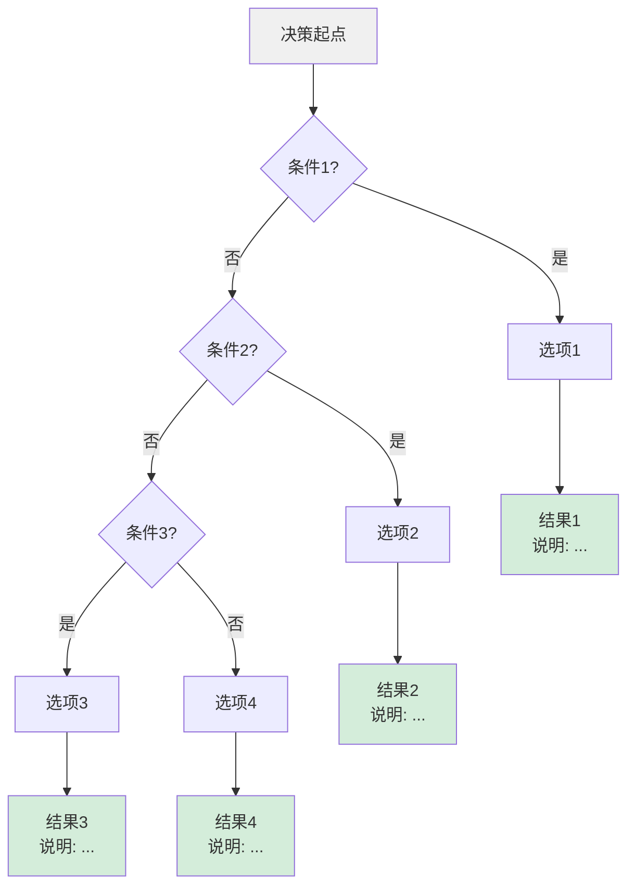
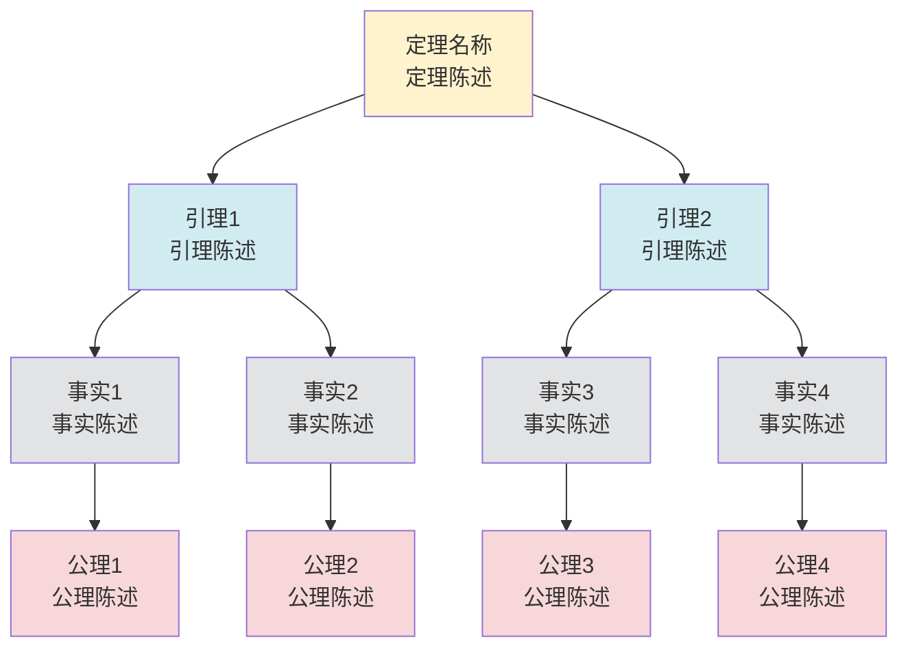
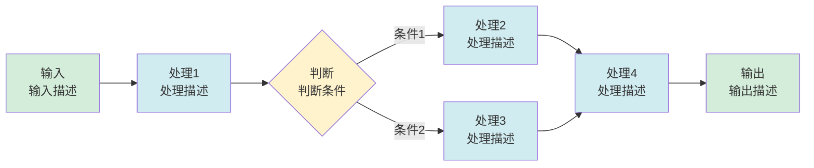
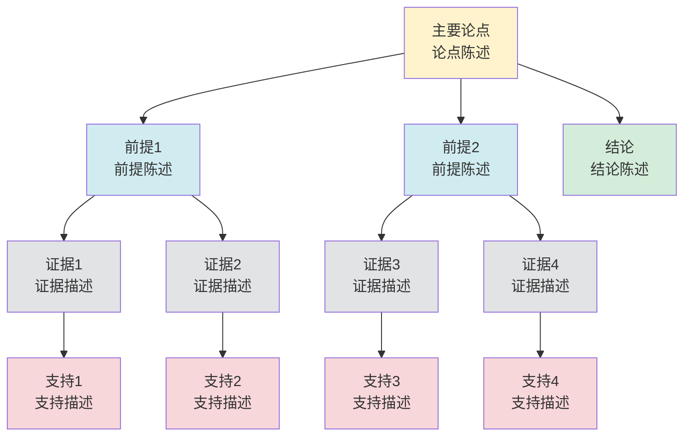

# 思维表征工具模板集合 / Mind Representation Tools Templates 2025

## 🎯 **模板概述 / Templates Overview**

本文档提供项目中各种思维表征工具的模板，供创建新工具时参考使用。

---

## 🗺️ **一、思维导图模板 / Mind Map Template**

### 模板结构

```markdown
    ### X.X 主题名称思维导图

    **用途**: 展示主题的知识结构和层次关系

    ```mermaid
    mindmap
      root((主题名称))
        一级概念1
          二级概念1.1
            三级概念1.1.1
              详细说明1.1.1.1
            三级概念1.1.2
              详细说明1.1.2.1
          二级概念1.2
            三级概念1.2.1
        一级概念2
          二级概念2.1
          二级概念2.2
    ```

    **说明**:

    - **一级概念**: 主题的主要分类
    - **二级概念**: 每个分类的子分类
    - **三级概念**: 具体的概念或方法
    - **详细说明**: 概念的详细描述

```

### 使用说明

1. **确定主题**: 明确要展示的主题
2. **构建层次**: 构建3-4级层次结构
3. **分组概念**: 合理分组相关概念
4. **添加说明**: 为关键概念添加详细说明

---

## 📊 **二、多维矩阵模板 / Multi-dimensional Matrix Template**

参考: [多维对比矩阵模板集合-2025.md](./多维对比矩阵模板集合-2025.md)

---

## 🌳 **三、决策树图模板 / Decision Tree Template**

### 模板结构

```markdown
### X.X 决策树图

**用途**: 帮助选择算法/方法/场景



**决策逻辑**:

- **条件1**: 判断标准1，如果满足则选择选项1
- **条件2**: 判断标准2，如果满足则选择选项2
- **条件3**: 判断标准3，如果满足则选择选项3
- **默认**: 如果不满足任何条件，选择选项4

**使用场景**:

- 场景1: 当...时，使用此决策树
- 场景2: 当...时，使用此决策树

```

### 使用说明

1. **确定决策起点**: 明确决策的起点和目的
2. **设计判断条件**: 设计清晰的判断条件
3. **定义选项结果**: 为每个选项定义明确的结果
4. **说明决策逻辑**: 说明决策的逻辑和使用场景

---

## 🌲 **四、证明树图模板 / Proof Tree Template**

### 模板结构

```markdown
### X.X 证明树图

**用途**: 展示定理证明的逻辑结构



**证明结构**:

- **定理**: 要证明的主要定理
- **引理**: 证明定理所需的引理
- **事实**: 引理依赖的事实
- **公理**: 证明的基础公理

**证明步骤**:

1. 步骤1: 使用公理1和公理2证明事实1
2. 步骤2: 使用公理3和公理4证明事实2
3. 步骤3: 使用事实1和事实2证明引理1
4. 步骤4: 使用事实3和事实4证明引理2
5. 步骤5: 使用引理1和引理2证明定理

```

### 使用说明

1. **确定定理**: 明确要证明的定理
2. **分解引理**: 将定理分解为引理
3. **识别事实**: 识别引理依赖的事实
4. **追溯公理**: 追溯证明的基础公理
5. **说明步骤**: 说明证明的详细步骤

---

## 🔄 **五、控制执行数据流图模板 / Control Flow & Data Flow Diagram Template**

### 模板结构

```markdown
### X.X 算法执行流程图

**用途**: 展示算法的执行流程



**流程说明**:

- **输入**: 算法的输入数据和格式
- **处理1**: 第一步处理，描述处理内容
- **判断**: 判断条件，根据条件选择不同路径
- **处理2/3**: 根据判断结果的不同处理
- **处理4**: 合并后的处理
- **输出**: 算法的输出结果

**数据流**:

- 数据1: 从输入到处理1
- 数据2: 从处理1到判断
- 数据3: 从判断到处理2/3
- 数据4: 从处理2/3到处理4
- 数据5: 从处理4到输出

```

### 使用说明

1. **确定输入输出**: 明确算法的输入和输出
2. **设计处理步骤**: 设计清晰的处理步骤
3. **添加判断条件**: 添加必要的判断条件
4. **说明数据流**: 说明数据在流程中的流转
5. **描述流程逻辑**: 描述流程的逻辑和执行顺序

---

## 🧠 **六、论证思维图模板 / Argumentation Map Template**

### 模板结构

```markdown
### X.X 论证思维图

**用途**: 展示主题的论证脉络和逻辑结构



**论证结构**:

- **主要论点**: 要论证的核心观点
- **前提**: 论证的前提条件
- **证据**: 支持前提的证据
- **支持**: 支持证据的进一步支持
- **结论**: 论证的最终结论

**论证逻辑**:

1. 前提1由证据1和证据2支持
2. 前提2由证据3和证据4支持
3. 主要论点由前提1和前提2支持
4. 从主要论点可以得出结论

```

### 使用说明

1. **确定主要论点**: 明确要论证的主要观点
2. **识别前提**: 识别论证的前提条件
3. **收集证据**: 收集支持前提的证据
4. **寻找支持**: 寻找支持证据的进一步支持
5. **得出结论**: 从论证中得出结论
6. **说明逻辑**: 说明论证的逻辑结构

---

## 📋 **七、模板使用指南 / Template Usage Guide**

### 7.1 工具选择

**根据用途选择工具**:
- 展示知识结构 → 使用思维导图
- 对比概念/理论/算法 → 使用多维矩阵
- 帮助选择决策 → 使用决策树图
- 展示证明结构 → 使用证明树图
- 展示执行流程 → 使用数据流图
- 展示论证逻辑 → 使用论证思维图

### 7.2 工具创建步骤

1. **确定工具类型**: 根据用途选择工具类型
2. **选择合适模板**: 选择对应的模板
3. **填写工具内容**: 详细填写工具内容
4. **验证工具质量**: 检查完整性、准确性、一致性

### 7.3 质量检查清单

- [ ] 工具内容完整（覆盖所有关键点）
- [ ] 工具内容准确（符合理论标准）
- [ ] 工具格式一致（使用统一格式）
- [ ] 工具结构清晰（层次分明、逻辑清晰）
- [ ] 工具易于理解（可视化直观、说明详细）

---

**文档创建时间**: 2025年1月
**最后更新**: 2025年1月
**维护者**: GraphNetWorkCommunicate项目组
**状态**: ✅ 模板集合完成
