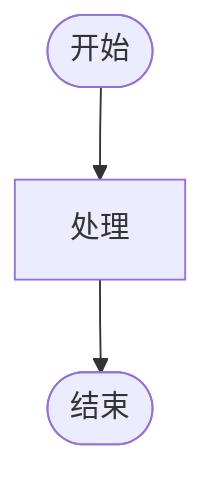
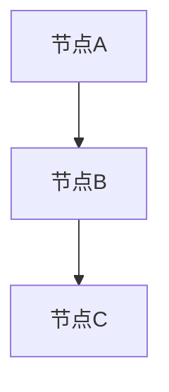

# 文档格式规范 / Document Format Standards 2025

## 🎯 **概述 / Overview**

本文档定义项目中所有文档的标准格式规范，确保格式统一性。

**创建时间**: 2025年1月
**适用范围**: 所有已扩展文件（32个）
**维护者**: GraphNetWorkCommunicate项目组

---

## 📊 **一、标题格式规范 / Heading Format Standards**

### 1.1 标题层级

| 层级 | Markdown语法 | 示例 | 使用场景 |
|------|------------|------|---------|
| 一级标题 | `#` | `# 文档标题` | 文档主标题 |
| 二级标题 | `##` | `## 章节标题` | 主要章节 |
| 三级标题 | `###` | `### 小节标题` | 小节 |
| 四级标题 | `####` | `#### 子节标题` | 子节 |
| 五级标题 | `#####` | `##### 细目标题` | 细目 |

### 1.2 标题格式要求

- ✅ 一级标题：文档标题，包含中英文
- ✅ 二级标题：主要章节，使用emoji图标（如📚、🎯、🔬等）
- ✅ 三级标题：小节，使用emoji图标
- ✅ 四级标题：子节，不使用emoji
- ✅ 五级标题：细目，不使用emoji

### 1.3 标题编号

- ✅ 二级标题：使用中文数字编号（一、二、三...）
- ✅ 三级标题：使用阿拉伯数字编号（1.1、1.2、1.3...）
- ✅ 四级标题：使用阿拉伯数字编号（1.1.1、1.1.2...）

---

## 📊 **二、列表格式规范 / List Format Standards**

### 2.1 无序列表

**标准格式**:
```markdown
- 项目1
- 项目2
- 项目3
```

**要求**:
- ✅ 使用 `-` 作为列表标记
- ✅ 列表项后空一格
- ✅ 嵌套列表使用2个空格缩进

### 2.2 有序列表

**标准格式**:
```markdown
1. 项目1
2. 项目2
3. 项目3
```

**要求**:
- ✅ 使用数字编号
- ✅ 编号后空一格
- ✅ 嵌套列表使用2个空格缩进

### 2.3 任务列表

**标准格式**:
```markdown
- [x] 已完成任务
- [ ] 待完成任务
```

**要求**:
- ✅ 使用 `- [x]` 表示已完成
- ✅ 使用 `- [ ]` 表示未完成
- ✅ 任务列表后空一格

---

## 📊 **三、表格格式规范 / Table Format Standards**

### 3.1 表格基本格式

**标准格式**:
```markdown
| 列1 | 列2 | 列3 |
|-----|-----|-----|
| 内容1 | 内容2 | 内容3 |
```

**要求**:
- ✅ 使用 `|` 分隔列
- ✅ 表头与内容用 `---` 分隔
- ✅ 列对齐：左对齐（默认）或居中对齐（`:---:`）

### 3.2 表格样式

| 样式 | 语法 | 使用场景 |
|------|------|---------|
| 左对齐 | `:---` | 默认对齐 |
| 居中对齐 | `:---:` | 数字、状态 |
| 右对齐 | `---:` | 数字列 |

---

## 📊 **四、代码块格式规范 / Code Block Format Standards**

### 4.1 代码块基本格式

**标准格式**:
```markdown
```language
代码内容
```
```

**要求**:
- ✅ 指定语言标识（如 `python`、`mermaid`等）
- ✅ 代码缩进使用4个空格或1个Tab
- ✅ 代码块前后各空一行

### 4.2 行内代码格式

**标准格式**:
```markdown
使用 `代码` 表示行内代码
```

**要求**:
- ✅ 使用单个反引号 `` ` ``
- ✅ 代码前后各空一格（如果不在行首/行尾）

---

## 📊 **五、Mermaid图表格式规范 / Mermaid Diagram Format Standards**

### 5.1 流程图格式

**标准格式**:
```markdown

```

**要求**:
- ✅ 使用 `flowchart TD` 或 `flowchart LR`
- ✅ 节点使用方括号 `[]` 或圆括号 `()`
- ✅ 添加样式定义（如 `style Start fill:#d4edda`）

### 5.2 关系图格式

**标准格式**:
```markdown

```

**要求**:
- ✅ 使用 `graph TD` 或 `graph LR`
- ✅ 节点使用方括号 `[]`
- ✅ 添加样式定义

---

## 📊 **六、数学公式格式规范 / Mathematical Formula Format Standards**

### 6.1 行内公式

**标准格式**:
```markdown
使用 $公式$ 表示行内公式
```

**示例**:
- 图的定义：$G = (V, E)$
- 复杂度：$O(|V| + |E|)$

### 6.2 块级公式

**标准格式**:
```markdown
$$
公式内容
$$
```

**示例**:
$$
\max \text{flow}(N) = \min \text{cut}(N)
$$

**要求**:
- ✅ 行内公式使用单个 `$`
- ✅ 块级公式使用双 `$$`
- ✅ 公式前后各空一行（块级公式）

---

## 📊 **七、引用格式规范 / Reference Format Standards**

### 7.1 文档引用

**标准格式**:
```markdown
参考文档：[文档名称](文档路径)
```

**要求**:
- ✅ 使用相对路径
- ✅ 路径使用正斜杠 `/`
- ✅ 链接文本使用中文

### 7.2 概念引用

**标准格式**:
```markdown
参见：[概念名称](#概念锚点)
```

**要求**:
- ✅ 使用文档内锚点链接
- ✅ 锚点使用小写和连字符

---

## 📊 **八、分隔线格式规范 / Separator Format Standards**

### 8.1 章节分隔线

**标准格式**:
```markdown
---
```

**要求**:
- ✅ 使用三个连字符 `---`
- ✅ 分隔线前后各空一行
- ✅ 用于主要章节之间

---

## 📋 **九、格式检查清单 / Format Checklist**

### 9.1 标题检查

- [ ] 所有标题使用正确的层级
- [ ] 所有标题使用正确的编号
- [ ] 所有标题使用正确的emoji（如适用）

### 9.2 列表检查

- [ ] 所有列表使用统一的标记
- [ ] 所有列表使用正确的缩进
- [ ] 所有任务列表使用正确的语法

### 9.3 表格检查

- [ ] 所有表格使用正确的语法
- [ ] 所有表格使用正确的对齐
- [ ] 所有表格内容完整

### 9.4 代码块检查

- [ ] 所有代码块指定语言
- [ ] 所有代码块使用正确的缩进
- [ ] 所有代码块前后有空行

### 9.5 Mermaid图表检查

- [ ] 所有Mermaid图表语法正确
- [ ] 所有Mermaid图表有样式定义
- [ ] 所有Mermaid图表可以正常渲染

### 9.6 数学公式检查

- [ ] 所有行内公式使用 `$`
- [ ] 所有块级公式使用 `$$`
- [ ] 所有公式语法正确

---

**文档版本**: v1.0
**创建时间**: 2025年1月
**最后更新**: 2025年1月
**维护者**: GraphNetWorkCommunicate项目组
**状态**: 🚀 持续更新中
