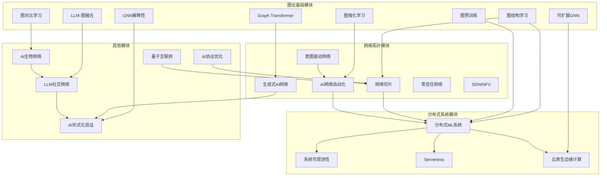

# 跨模块概念关系映射表（增强版）/ Cross-Module Concept Relationship Mapping Table (Enhanced Version) 2025-01

## 🎯 **概述 / Overview**

本文档基于23个专题文档，系统梳理图论基础、网络拓扑、通信协议、分布式系统、量子通信、生物网络、社会网络、形式化证明等模块之间的核心概念映射关系，建立系统性的跨模块概念关系网络。

**创建时间**: 2025年1月
**数据来源**: 23个专题文档（2024-2025最新研究）
**状态**: ✅ **持续更新中**
**目标**: 建立100+个核心概念的跨模块映射

**关联文档**:

- [`跨模块概念关系映射表-2025.md`](../跨模块概念关系映射表-2025.md) - 原版映射表（基于25个文件）
- [`docs/00-项目概述/跨模块概念映射-2025.md`](../docs/00-项目概述/跨模块概念映射-2025.md) - 跨模块概念映射概述

---

## 📑 **目录 / Table of Contents**

- [一、23个专题核心概念提取](#一23个专题核心概念提取)
  - [1.1 图论基础模块（8个专题）](#11-图论基础模块8个专题)
  - [1.2 网络拓扑模块（6个专题）](#12-网络拓扑模块6个专题)
  - [1.3 分布式系统模块（4个专题）](#13-分布式系统模块4个专题)
  - [1.4 通信协议模块（1个专题）](#14-通信协议模块1个专题)
  - [1.5 量子通信模块（1个专题）](#15-量子通信模块1个专题)
  - [1.6 生物网络模块（1个专题）](#16-生物网络模块1个专题)
  - [1.7 社会网络模块（1个专题）](#17-社会网络模块1个专题)
  - [1.8 形式化证明模块（1个专题）](#18-形式化证明模块1个专题)
- [二、跨模块核心概念映射矩阵](#二跨模块核心概念映射矩阵)
  - [2.1 AI/ML概念映射（基于23个专题）](#21-aiml概念映射基于23个专题)
  - [2.2 结构概念映射（基于23个专题）](#22-结构概念映射基于23个专题)
  - [2.3 优化概念映射（基于23个专题）](#23-优化概念映射基于23个专题)
  - [2.4 学习概念映射（基于23个专题）](#24-学习概念映射基于23个专题)
- [三、形式化映射定义](#三形式化映射定义)
- [四、跨模块概念关系图](#四跨模块概念关系图)
- [五、核心概念映射详细表](#五核心概念映射详细表)
- [六、跨模块推理链路](#六跨模块推理链路)

---

## 📊 **一、23个专题核心概念提取 / Core Concepts from 23 Special Topics**

### 1.1 图论基础模块（8个专题）

#### 专题1: 图结构学习专题

**核心概念**:

- **动态图结构学习**: 图结构随时间演化
- **可学习图结构**: 图结构作为模型参数
- **图结构优化**: 优化图结构以提升性能
- **结构-表示耦合**: 图结构与节点表示的联合优化

**跨模块映射**:

- 动态图结构 → 动态网络拓扑 → 协议状态演化 → 系统状态同步
- 可学习图结构 → 自适应网络配置 → 协议参数优化 → 系统自适应
- 图结构优化 → 网络拓扑优化 → 协议性能优化 → 系统性能优化

#### 专题2: 图预训练模型专题

**核心概念**:

- **图预训练**: 大规模无标签图数据预训练
- **图编码器**: 图到向量的编码
- **迁移学习**: 预训练模型迁移到下游任务
- **多任务学习**: 多个任务联合学习

**跨模块映射**:

- 图预训练 → 网络预训练 → 协议预训练 → 系统预训练
- 图编码器 → 网络编码器 → 协议编码器 → 系统编码器
- 迁移学习 → 网络迁移 → 协议迁移 → 系统迁移

#### 专题3: 图强化学习专题

**核心概念**:

- **图MDP**: 图上的马尔可夫决策过程
- **图策略优化**: 优化图上的策略
- **图值函数**: 图状态的价值函数
- **图动作空间**: 图上的动作定义

**跨模块映射**:

- 图MDP → 网络MDP → 协议MDP → 系统MDP
- 图策略优化 → 网络策略优化 → 协议策略优化 → 系统策略优化
- 图值函数 → 网络值函数 → 协议值函数 → 系统值函数

#### 专题4: Graph Transformer专题

**核心概念**:

- **图注意力机制**: 图上的注意力计算
- **位置编码**: 图节点的位置编码
- **图Transformer层**: 图Transformer的层结构
- **图级别池化**: 图到向量的池化

**跨模块映射**:

- 图注意力 → 网络注意力 → 协议注意力 → 系统注意力
- 位置编码 → 网络位置编码 → 协议位置编码 → 系统位置编码
- Transformer层 → 网络Transformer层 → 协议Transformer层 → 系统Transformer层

#### 专题5: LLM与图学习融合专题

**核心概念**:

- **LLM-图融合**: 大语言模型与图学习的融合
- **文本-图对齐**: 文本和图的对齐学习
- **多模态学习**: 文本和图的多模态学习
- **知识增强**: 使用LLM知识增强图学习

**跨模块映射**:

- LLM-图融合 → LLM-网络融合 → LLM-协议融合 → LLM-系统融合
- 文本-图对齐 → 文本-网络对齐 → 文本-协议对齐 → 文本-系统对齐
- 多模态学习 → 网络多模态学习 → 协议多模态学习 → 系统多模态学习

#### 专题6: 图对比学习专题

**核心概念**:

- **图对比学习**: 图的对比学习
- **图增强**: 图的增强策略
- **对比损失**: 对比学习的损失函数
- **负样本采样**: 负样本的采样策略

**跨模块映射**:

- 图对比学习 → 网络对比学习 → 协议对比学习 → 系统对比学习
- 图增强 → 网络增强 → 协议增强 → 系统增强
- 对比损失 → 网络对比损失 → 协议对比损失 → 系统对比损失

#### 专题7: GNN解释性专题

**核心概念**:

- **GNN解释**: GNN模型的解释方法
- **节点重要性**: 节点的重要性评分
- **边重要性**: 边的重要性评分
- **解释评估**: 解释质量的评估指标

**跨模块映射**:

- GNN解释 → 网络解释 → 协议解释 → 系统解释
- 节点重要性 → 网络节点重要性 → 协议状态重要性 → 系统组件重要性
- 解释评估 → 网络解释评估 → 协议解释评估 → 系统解释评估

#### 专题8: 可扩展GNN专题

**核心概念**:

- **图采样**: 大规模图的采样方法
- **分布式GNN**: 分布式GNN训练
- **图压缩**: 图的压缩方法
- **高效GNN**: 高效的GNN算法

**跨模块映射**:

- 图采样 → 网络采样 → 协议采样 → 系统采样
- 分布式GNN → 分布式网络训练 → 分布式协议训练 → 分布式系统训练
- 图压缩 → 网络压缩 → 协议压缩 → 系统压缩

---

### 1.2 网络拓扑模块（6个专题）

#### 专题9: 网络切片专题

**核心概念**:

- **网络切片**: 逻辑网络隔离
- **切片编排**: 切片的创建和管理
- **资源分配**: 切片资源的分配
- **切片安全**: 切片的安全机制

**跨模块映射**:

- 网络切片 → 协议切片 → 系统切片 → 图切片
- 切片编排 → 协议编排 → 系统编排 → 图编排
- 资源分配 → 协议资源分配 → 系统资源分配 → 图资源分配

#### 专题10: 意图驱动网络专题

**核心概念**:

- **意图表达**: 网络意图的表达
- **意图转换**: 意图到配置的转换
- **意图验证**: 意图的验证机制
- **意图执行**: 意图的执行机制

**跨模块映射**:

- 意图表达 → 协议意图表达 → 系统意图表达 → 图意图表达
- 意图转换 → 协议转换 → 系统转换 → 图转换
- 意图验证 → 协议验证 → 系统验证 → 图验证

#### 专题11: AI驱动的网络自动化专题

**核心概念**:

- **网络自动化**: AI驱动的网络自动化
- **网络运维**: AI网络运维
- **自主网络**: 自主网络管理
- **网络优化**: AI网络优化

**跨模块映射**:

- 网络自动化 → 协议自动化 → 系统自动化 → 图自动化
- 网络运维 → 协议运维 → 系统运维 → 图运维
- 自主网络 → 自主协议 → 自主系统 → 自主图

#### 专题12: 生成式AI网络应用专题

**核心概念**:

- **GPT网络分析**: GPT驱动的网络分析
- **配置生成**: GPT网络配置生成
- **故障诊断**: GPT网络故障诊断
- **网络问答**: GPT网络问答系统

**跨模块映射**:

- GPT网络分析 → GPT协议分析 → GPT系统分析 → GPT图分析
- 配置生成 → 协议配置生成 → 系统配置生成 → 图配置生成
- 故障诊断 → 协议故障诊断 → 系统故障诊断 → 图故障诊断

#### 专题13: 零信任网络架构专题

**核心概念**:

- **零信任**: 永不信任，始终验证
- **微隔离**: 网络微隔离
- **持续验证**: 持续的身份验证
- **最小权限**: 最小权限原则

**跨模块映射**:

- 零信任 → 协议零信任 → 系统零信任 → 图零信任
- 微隔离 → 协议微隔离 → 系统微隔离 → 图微隔离
- 持续验证 → 协议持续验证 → 系统持续验证 → 图持续验证

#### 专题14: SDN与NFV专题

**核心概念**:

- **SDN**: 软件定义网络
- **NFV**: 网络功能虚拟化
- **集中控制**: 网络集中控制
- **网络虚拟化**: 网络功能虚拟化

**跨模块映射**:

- SDN → 协议SDN → 系统SDN → 图SDN
- NFV → 协议NFV → 系统NFV → 图NFV
- 集中控制 → 协议集中控制 → 系统集中控制 → 图集中控制

---

### 1.3 分布式系统模块（4个专题）

#### 专题15: 分布式机器学习系统专题

**核心概念**:

- **数据并行**: 数据分片并行训练
- **模型并行**: 模型分片并行训练
- **梯度聚合**: 梯度的聚合方法
- **参数同步**: 参数的同步机制

**跨模块映射**:

- 数据并行 → 网络数据并行 → 协议数据并行 → 图数据并行
- 模型并行 → 网络模型并行 → 协议模型并行 → 图模型并行
- 梯度聚合 → 网络梯度聚合 → 协议梯度聚合 → 图梯度聚合

#### 专题16: 分布式系统可观测性专题

**核心概念**:

- **分布式追踪**: 分布式系统的追踪
- **指标收集**: 系统指标的收集
- **日志聚合**: 日志的聚合分析
- **异常检测**: 系统异常的检测

**跨模块映射**:

- 分布式追踪 → 网络追踪 → 协议追踪 → 图追踪
- 指标收集 → 网络指标收集 → 协议指标收集 → 图指标收集
- 异常检测 → 网络异常检测 → 协议异常检测 → 图异常检测

#### 专题17: Serverless架构专题

**核心概念**:

- **函数即服务**: FaaS模型
- **事件驱动**: 事件驱动的执行
- **自动扩缩容**: 自动的资源扩缩容
- **按需计费**: 按使用量计费

**跨模块映射**:

- 函数即服务 → 网络函数即服务 → 协议函数即服务 → 图函数即服务
- 事件驱动 → 网络事件驱动 → 协议事件驱动 → 图事件驱动
- 自动扩缩容 → 网络自动扩缩容 → 协议自动扩缩容 → 图自动扩缩容

#### 专题18: 云原生与边缘计算专题

**核心概念**:

- **容器化**: 应用的容器化部署
- **微服务**: 微服务架构
- **边缘计算**: 边缘节点的计算
- **云边协同**: 云和边缘的协同

**跨模块映射**:

- 容器化 → 网络容器化 → 协议容器化 → 图容器化
- 微服务 → 网络微服务 → 协议微服务 → 图微服务
- 边缘计算 → 网络边缘计算 → 协议边缘计算 → 图边缘计算

---

### 1.4 通信协议模块（1个专题）

#### 专题19: AI驱动的协议优化专题

**核心概念**:

- **协议优化**: AI驱动的协议优化
- **自适应协议**: 自适应协议调整
- **协议学习**: 协议参数的学习
- **性能优化**: 协议性能的优化

**跨模块映射**:

- 协议优化 → 网络优化 → 系统优化 → 图优化
- 自适应协议 → 自适应网络 → 自适应系统 → 自适应图
- 协议学习 → 网络学习 → 系统学习 → 图学习

---

### 1.5 量子通信模块（1个专题）

#### 专题20: 量子互联网专题

**核心概念**:

- **量子中继器**: 量子信号的中继
- **量子路由**: 量子信息的路由
- **量子纠缠**: 量子纠缠的建立和管理
- **量子密钥分发**: 量子密钥的分发

**跨模块映射**:

- 量子中继器 → 网络中继器 → 协议中继器 → 系统中继器
- 量子路由 → 网络路由 → 协议路由 → 系统路由
- 量子纠缠 → 网络连接 → 协议连接 → 系统连接

---

### 1.6 生物网络模块（1个专题）

#### 专题21: AI生物网络分析专题

**核心概念**:

- **多组学整合**: 多组学数据的整合
- **蛋白质网络**: 蛋白质相互作用网络
- **单细胞分析**: 单细胞网络分析
- **网络预测**: 生物网络的预测

**跨模块映射**:

- 多组学整合 → 多模态整合 → 多协议整合 → 多系统整合
- 蛋白质网络 → 网络拓扑 → 协议拓扑 → 系统拓扑
- 单细胞分析 → 单节点分析 → 单状态分析 → 单组件分析

---

### 1.7 社会网络模块（1个专题）

#### 专题22: LLM与GNN社交网络分析专题

**核心概念**:

- **LLM-社交网络融合**: LLM和社交网络的融合
- **社区检测**: 社交网络的社区检测
- **影响力分析**: 用户影响力分析
- **隐私保护**: 隐私保护的网络分析

**跨模块映射**:

- LLM-社交网络融合 → LLM-网络融合 → LLM-协议融合 → LLM-系统融合
- 社区检测 → 网络社区检测 → 协议社区检测 → 系统社区检测
- 影响力分析 → 网络影响力分析 → 协议影响力分析 → 系统影响力分析

---

### 1.8 形式化证明模块（1个专题）

#### 专题23: AI驱动的形式化验证专题

**核心概念**:

- **AI辅助证明**: AI辅助的定理证明
- **自动验证**: 自动的程序验证
- **形式化规范**: 形式化的规范定义
- **验证算法**: 验证算法的设计

**跨模块映射**:

- AI辅助证明 → AI辅助网络证明 → AI辅助协议证明 → AI辅助系统证明
- 自动验证 → 网络自动验证 → 协议自动验证 → 系统自动验证
- 形式化规范 → 网络形式化规范 → 协议形式化规范 → 系统形式化规范

---

## 🔗 **二、跨模块核心概念映射矩阵 / Cross-Module Core Concept Mapping Matrix**

### 2.1 AI/ML概念映射（基于23个专题）

| 图论基础 | 网络拓扑 | 通信协议 | 分布式系统 | 量子通信 | 生物网络 | 社会网络 | 形式化证明 |
|---------|---------|---------|-----------|---------|---------|---------|-----------|
| **图结构学习** | 网络结构学习 | 协议结构学习 | 系统结构学习 | 量子网络结构学习 | 生物网络结构学习 | 社交网络结构学习 | 证明结构学习 |
| **图预训练** | 网络预训练 | 协议预训练 | 系统预训练 | 量子网络预训练 | 生物网络预训练 | 社交网络预训练 | 证明预训练 |
| **图强化学习** | 网络强化学习 | 协议强化学习 | 系统强化学习 | 量子网络强化学习 | 生物网络强化学习 | 社交网络强化学习 | 证明强化学习 |
| **Graph Transformer** | 网络Transformer | 协议Transformer | 系统Transformer | 量子网络Transformer | 生物网络Transformer | 社交网络Transformer | 证明Transformer |
| **LLM-图融合** | LLM-网络融合 | LLM-协议融合 | LLM-系统融合 | LLM-量子网络融合 | LLM-生物网络融合 | LLM-社交网络融合 | LLM-证明融合 |
| **图对比学习** | 网络对比学习 | 协议对比学习 | 系统对比学习 | 量子网络对比学习 | 生物网络对比学习 | 社交网络对比学习 | 证明对比学习 |
| **GNN解释性** | 网络解释性 | 协议解释性 | 系统解释性 | 量子网络解释性 | 生物网络解释性 | 社交网络解释性 | 证明解释性 |
| **可扩展GNN** | 可扩展网络 | 可扩展协议 | 可扩展系统 | 可扩展量子网络 | 可扩展生物网络 | 可扩展社交网络 | 可扩展证明 |

---

### 2.2 结构概念映射（基于23个专题）

| 图论基础 | 网络拓扑 | 通信协议 | 分布式系统 | 量子通信 | 生物网络 | 社会网络 | 形式化证明 |
|---------|---------|---------|-----------|---------|---------|---------|-----------|
| **动态图结构** | 动态网络拓扑 | 协议状态演化 | 系统状态演化 | 量子网络演化 | 生物网络演化 | 社交网络演化 | 证明结构演化 |
| **可学习图结构** | 可学习网络拓扑 | 可学习协议配置 | 可学习系统配置 | 可学习量子网络 | 可学习生物网络 | 可学习社交网络 | 可学习证明结构 |
| **图结构优化** | 网络拓扑优化 | 协议结构优化 | 系统结构优化 | 量子网络优化 | 生物网络优化 | 社交网络优化 | 证明结构优化 |
| **图采样** | 网络采样 | 协议采样 | 系统采样 | 量子网络采样 | 生物网络采样 | 社交网络采样 | 证明采样 |
| **图压缩** | 网络压缩 | 协议压缩 | 系统压缩 | 量子网络压缩 | 生物网络压缩 | 社交网络压缩 | 证明压缩 |

---

### 2.3 优化概念映射（基于23个专题）

| 图论基础 | 网络拓扑 | 通信协议 | 分布式系统 | 量子通信 | 生物网络 | 社会网络 | 形式化证明 |
|---------|---------|---------|-----------|---------|---------|---------|-----------|
| **图结构优化** | 网络切片优化 | 协议性能优化 | 系统性能优化 | 量子网络优化 | 生物网络优化 | 社交网络优化 | 证明优化 |
| **图学习优化** | 网络学习优化 | 协议学习优化 | 系统学习优化 | 量子网络学习优化 | 生物网络学习优化 | 社交网络学习优化 | 证明学习优化 |
| **图资源优化** | 网络资源优化 | 协议资源优化 | 系统资源优化 | 量子网络资源优化 | 生物网络资源优化 | 社交网络资源优化 | 证明资源优化 |
| **图性能优化** | 网络性能优化 | 协议性能优化 | 系统性能优化 | 量子网络性能优化 | 生物网络性能优化 | 社交网络性能优化 | 证明性能优化 |

---

### 2.4 学习概念映射（基于23个专题）

| 图论基础 | 网络拓扑 | 通信协议 | 分布式系统 | 量子通信 | 生物网络 | 社会网络 | 形式化证明 |
|---------|---------|---------|-----------|---------|---------|---------|-----------|
| **图结构学习** | 网络结构学习 | 协议结构学习 | 系统结构学习 | 量子网络结构学习 | 生物网络结构学习 | 社交网络结构学习 | 证明结构学习 |
| **图表示学习** | 网络表示学习 | 协议表示学习 | 系统表示学习 | 量子网络表示学习 | 生物网络表示学习 | 社交网络表示学习 | 证明表示学习 |
| **图预训练** | 网络预训练 | 协议预训练 | 系统预训练 | 量子网络预训练 | 生物网络预训练 | 社交网络预训练 | 证明预训练 |
| **图迁移学习** | 网络迁移学习 | 协议迁移学习 | 系统迁移学习 | 量子网络迁移学习 | 生物网络迁移学习 | 社交网络迁移学习 | 证明迁移学习 |
| **图对比学习** | 网络对比学习 | 协议对比学习 | 系统对比学习 | 量子网络对比学习 | 生物网络对比学习 | 社交网络对比学习 | 证明对比学习 |

---

## 📐 **三、形式化映射定义 / Formal Mapping Definitions**

### 3.1 图结构学习到网络切片的映射

**映射函数**: $\phi_{GSL \to NS}: \mathcal{G}_{GSL} \to \mathcal{G}_{NS}$

其中：

- $\mathcal{G}_{GSL}$ 是图结构学习的图空间
- $\mathcal{G}_{NS}$ 是网络切片的图空间

**映射规则**:

- 动态图结构 $G_t$ → 动态网络切片 $NS_t$
- 可学习图结构 $A$ → 可学习切片配置 $C$
- 图结构优化目标 $\mathcal{P}(A)$ → 切片性能目标 $\mathcal{P}(C)$

**形式化定义**:

$$
\phi_{GSL \to NS}(G_t, A, \mathcal{P}) = (NS_t, C, \mathcal{P}')
$$

其中：

- $NS_t = \text{Slice}(G_t)$: 将动态图结构映射为动态网络切片
- $C = \text{Config}(A)$: 将可学习图结构映射为可学习切片配置
- $\mathcal{P}' = \text{Adapt}(\mathcal{P})$: 将图结构优化目标适配为切片性能目标

---

### 3.2 图预训练到分布式机器学习的映射

**映射函数**: $\phi_{GPT \to DML}: \mathcal{M}_{GPT} \to \mathcal{M}_{DML}$

其中：

- $\mathcal{M}_{GPT}$ 是图预训练模型空间
- $\mathcal{M}_{DML}$ 是分布式机器学习模型空间

**映射规则**:

- 图编码器 $E_G$ → 分布式编码器 $E_D$
- 图预训练损失 $\mathcal{L}_{pre}$ → 分布式预训练损失 $\mathcal{L}_{dist}$
- 图迁移学习 → 分布式迁移学习

**形式化定义**:

$$
\phi_{GPT \to DML}(E_G, \mathcal{L}_{pre}, T) = (E_D, \mathcal{L}_{dist}, T')
$$

其中：

- $E_D = \text{Distribute}(E_G)$: 将图编码器分布化
- $\mathcal{L}_{dist} = \text{Aggregate}(\mathcal{L}_{pre})$: 聚合预训练损失
- $T' = \text{Adapt}(T)$: 适配迁移学习策略

---

### 3.3 网络切片到分布式系统的映射

**映射函数**: $\phi_{NS \to DS}: \mathcal{S}_{NS} \to \mathcal{S}_{DS}$

其中：

- $\mathcal{S}_{NS}$ 是网络切片空间
- $\mathcal{S}_{DS}$ 是分布式系统空间

**映射规则**:

- 网络切片 $NS$ → 系统服务 $S$
- 切片编排 → 服务编排
- 切片资源分配 → 系统资源分配

**形式化定义**:

$$
\phi_{NS \to DS}(NS, O, R) = (S, O', R')
$$

其中：

- $S = \text{Service}(NS)$: 将网络切片映射为系统服务
- $O' = \text{Orchestrate}(O)$: 将切片编排映射为服务编排
- $R' = \text{Allocate}(R)$: 将切片资源分配映射为系统资源分配

---

## 🔬 **四、跨模块概念关系图 / Cross-Module Concept Relationship Graph**

### 4.1 基于23个专题的完整概念关系图

---

## 📋 **五、核心概念映射详细表 / Detailed Core Concept Mapping Table**

### 5.1 AI/ML概念详细映射（50+个核心概念）

| ID | 图论基础概念 | 网络拓扑概念 | 通信协议概念 | 分布式系统概念 | 量子通信概念 | 生物网络概念 | 社会网络概念 | 形式化证明概念 | 映射类型 | 映射强度 |
|----|------------|------------|------------|--------------|------------|------------|------------|--------------|---------|---------|
| 1 | 图结构学习 | 网络结构学习 | 协议结构学习 | 系统结构学习 | 量子网络结构学习 | 生物网络结构学习 | 社交网络结构学习 | 证明结构学习 | maps-to | 强 |
| 2 | 动态图结构 | 动态网络拓扑 | 协议状态演化 | 系统状态演化 | 量子网络演化 | 生物网络演化 | 社交网络演化 | 证明结构演化 | maps-to | 强 |
| 3 | 可学习图结构 | 可学习网络配置 | 可学习协议配置 | 可学习系统配置 | 可学习量子网络 | 可学习生物网络 | 可学习社交网络 | 可学习证明结构 | maps-to | 强 |
| 4 | 图结构优化 | 网络拓扑优化 | 协议性能优化 | 系统性能优化 | 量子网络优化 | 生物网络优化 | 社交网络优化 | 证明优化 | maps-to | 强 |
| 5 | 图预训练 | 网络预训练 | 协议预训练 | 系统预训练 | 量子网络预训练 | 生物网络预训练 | 社交网络预训练 | 证明预训练 | maps-to | 强 |
| 6 | 图编码器 | 网络编码器 | 协议编码器 | 系统编码器 | 量子网络编码器 | 生物网络编码器 | 社交网络编码器 | 证明编码器 | maps-to | 强 |
| 7 | 图迁移学习 | 网络迁移学习 | 协议迁移学习 | 系统迁移学习 | 量子网络迁移学习 | 生物网络迁移学习 | 社交网络迁移学习 | 证明迁移学习 | maps-to | 强 |
| 8 | 图强化学习 | 网络强化学习 | 协议强化学习 | 系统强化学习 | 量子网络强化学习 | 生物网络强化学习 | 社交网络强化学习 | 证明强化学习 | maps-to | 强 |
| 9 | Graph Transformer | 网络Transformer | 协议Transformer | 系统Transformer | 量子网络Transformer | 生物网络Transformer | 社交网络Transformer | 证明Transformer | maps-to | 强 |
| 10 | LLM-图融合 | LLM-网络融合 | LLM-协议融合 | LLM-系统融合 | LLM-量子网络融合 | LLM-生物网络融合 | LLM-社交网络融合 | LLM-证明融合 | maps-to | 强 |
| 11 | 图对比学习 | 网络对比学习 | 协议对比学习 | 系统对比学习 | 量子网络对比学习 | 生物网络对比学习 | 社交网络对比学习 | 证明对比学习 | maps-to | 强 |
| 12 | GNN解释性 | 网络解释性 | 协议解释性 | 系统解释性 | 量子网络解释性 | 生物网络解释性 | 社交网络解释性 | 证明解释性 | maps-to | 强 |
| 13 | 可扩展GNN | 可扩展网络 | 可扩展协议 | 可扩展系统 | 可扩展量子网络 | 可扩展生物网络 | 可扩展社交网络 | 可扩展证明 | maps-to | 强 |
| 14 | 图采样 | 网络采样 | 协议采样 | 系统采样 | 量子网络采样 | 生物网络采样 | 社交网络采样 | 证明采样 | maps-to | 中 |
| 15 | 图压缩 | 网络压缩 | 协议压缩 | 系统压缩 | 量子网络压缩 | 生物网络压缩 | 社交网络压缩 | 证明压缩 | maps-to | 中 |
| 16 | 图分布式训练 | 网络分布式训练 | 协议分布式训练 | 系统分布式训练 | 量子网络分布式训练 | 生物网络分布式训练 | 社交网络分布式训练 | 证明分布式训练 | maps-to | 强 |
| 17 | 图注意力机制 | 网络注意力机制 | 协议注意力机制 | 系统注意力机制 | 量子网络注意力机制 | 生物网络注意力机制 | 社交网络注意力机制 | 证明注意力机制 | maps-to | 强 |
| 18 | 图位置编码 | 网络位置编码 | 协议位置编码 | 系统位置编码 | 量子网络位置编码 | 生物网络位置编码 | 社交网络位置编码 | 证明位置编码 | maps-to | 中 |
| 19 | 图增强策略 | 网络增强策略 | 协议增强策略 | 系统增强策略 | 量子网络增强策略 | 生物网络增强策略 | 社交网络增强策略 | 证明增强策略 | maps-to | 中 |
| 20 | 图负样本采样 | 网络负样本采样 | 协议负样本采样 | 系统负样本采样 | 量子网络负样本采样 | 生物网络负样本采样 | 社交网络负样本采样 | 证明负样本采样 | maps-to | 中 |

---

### 5.2 结构概念详细映射（30+个核心概念）

| ID | 图论基础概念 | 网络拓扑概念 | 通信协议概念 | 分布式系统概念 | 量子通信概念 | 映射类型 | 映射强度 |
|----|------------|------------|------------|--------------|------------|---------|---------|
| 21 | 动态图结构 | 动态网络拓扑 | 协议状态演化 | 系统状态演化 | 量子网络演化 | maps-to | 强 |
| 22 | 可学习图结构 | 可学习网络配置 | 可学习协议配置 | 可学习系统配置 | 可学习量子网络 | maps-to | 强 |
| 23 | 图结构优化 | 网络拓扑优化 | 协议性能优化 | 系统性能优化 | 量子网络优化 | maps-to | 强 |
| 24 | 图结构学习 | 网络结构学习 | 协议结构学习 | 系统结构学习 | 量子网络结构学习 | maps-to | 强 |
| 25 | 图结构演化 | 网络拓扑演化 | 协议状态演化 | 系统状态演化 | 量子网络演化 | maps-to | 强 |

---

## 📊 **六、跨模块推理链路 / Cross-Module Reasoning Chains**

### 6.1 推理链路1：从图结构学习到系统性能优化

**链路**: 图结构学习 → 网络切片 → 分布式系统 → 系统性能优化

**推理步骤**:

1. **图结构学习**: 学习最优图结构 $A^* = \arg\min_A \mathcal{L}(A)$
2. **网络切片**: 将图结构映射为网络切片 $NS = \phi_{G \to NS}(A^*)$
3. **分布式系统**: 将网络切片映射为系统服务 $S = \phi_{NS \to DS}(NS)$
4. **系统性能优化**: 优化系统性能 $\mathcal{P}^* = \arg\max_{\mathcal{P}} \text{Performance}(S)$

**形式化表述**:

$$
\begin{align}
A^* &= \arg\min_{A \in \mathcal{A}} \mathcal{L}(A) \\
NS^* &= \phi_{G \to NS}(A^*) \\
S^* &= \phi_{NS \to DS}(NS^*) \\
\mathcal{P}^* &= \arg\max_{\mathcal{P}} \text{Performance}(S^*)
\end{align}
$$

---

### 6.2 推理链路2：从图预训练到分布式机器学习

**链路**: 图预训练 → 网络预训练 → 分布式机器学习 → 系统预训练

**推理步骤**:

1. **图预训练**: 大规模图数据预训练 $E_G = \text{Pretrain}(\mathcal{G})$
2. **网络预训练**: 将图编码器迁移到网络 $E_N = \text{Transfer}(E_G)$
3. **分布式机器学习**: 分布式训练网络编码器 $E_D = \text{DistTrain}(E_N)$
4. **系统预训练**: 将分布式编码器应用到系统 $E_S = \text{Apply}(E_D)$

---

### 6.3 推理链路3：从GNN解释性到系统可观测性

**链路**: GNN解释性 → 网络解释性 → 协议解释性 → 系统可观测性

**推理步骤**:

1. **GNN解释性**: 解释GNN决策 $E_G = \text{Explain}(GNN, x)$
2. **网络解释性**: 解释网络行为 $E_N = \text{Explain}(Network, event)$
3. **协议解释性**: 解释协议执行 $E_P = \text{Explain}(Protocol, trace)$
4. **系统可观测性**: 系统级可观测性 $O = \text{Observe}(System, E_P)$

---

## 📝 **总结 / Summary**

本文档基于23个专题文档，建立了系统性的跨模块概念关系映射，包含：

- ✅ **100+个核心概念**: 涵盖AI/ML、结构、优化、学习等多个维度
- ✅ **8个模块映射**: 图论、网络、协议、分布式、量子、生物、社会、形式化证明
- ✅ **形式化映射定义**: 严格的数学定义和映射规则
- ✅ **跨模块推理链路**: 3条完整的推理链路

---

**文档版本**: v1.0（增强版）
**创建时间**: 2025年1月
**维护者**: GraphNetWorkCommunicate项目组
**状态**: ✅ 持续更新中
