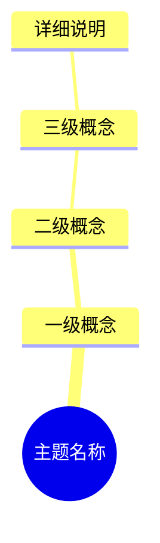
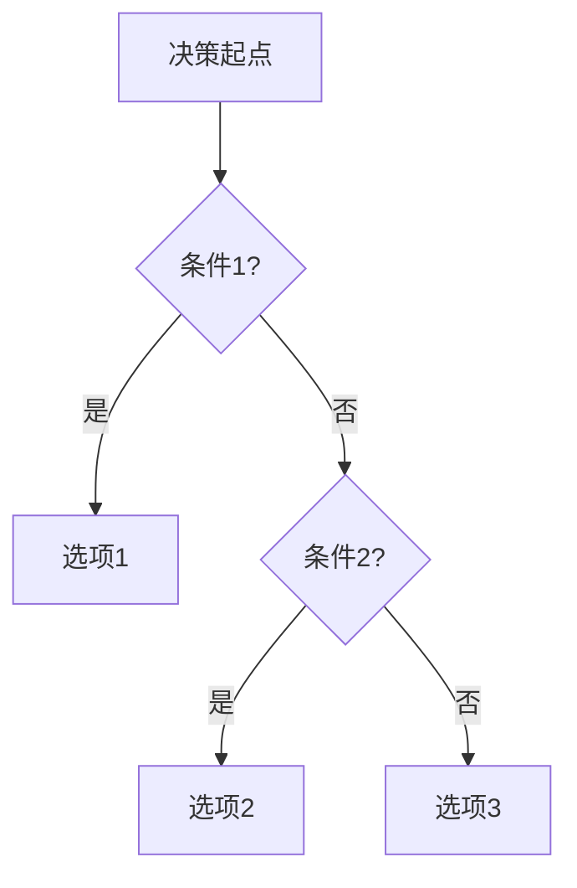
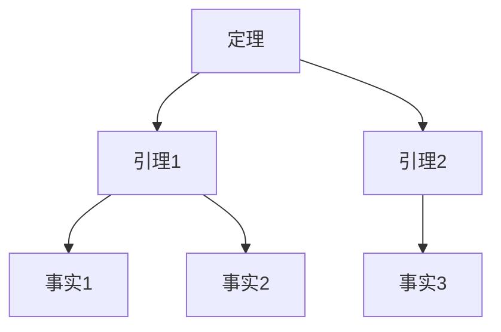
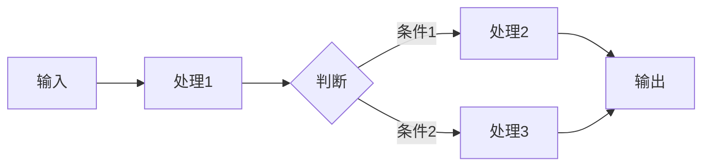
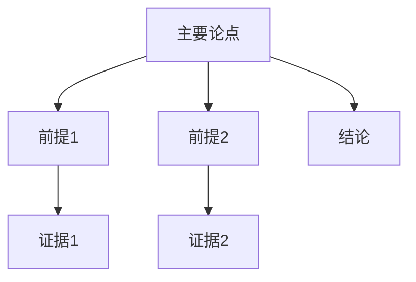

# 项目概念全面梳理与任务编排 / Project Concept Comprehensive Analysis and Task Planning 2025

## 🎯 **执行摘要 / Executive Summary**

根据项目定位（理论梳理与认知归纳项目），本文档进行全面概念梳理，识别缺失的概念定义、属性关系、解释论证等，建立多维对比矩阵和思维表征框架，制定全面的任务编排计划。

**核心目标**:

1. **扩展项目广度**: 全面梳理所有概念，识别缺失内容
2. **建立概念体系**: 明确概念定义、属性关系、解释论证
3. **构建多维矩阵**: 建立概念对比矩阵框架
4. **完善思维表征**: 结合多种思维表征方式
5. **制定任务编排**: 列出计划、任务、编排后再持续推进

---

## 📊 **一、当前概念覆盖情况分析 / Current Concept Coverage Analysis**

### 1.1 已扩展文件的概念覆盖情况

**已完成的25个文件**:

| 模块 | 文件数 | 概念定义 | 属性关系 | 多维矩阵 | 思维表征 | 完成度 |
|------|--------|---------|---------|---------|---------|--------|
| 图论基础 | 7个 | ✅ 完整 | ⚠️ 部分 | ⚠️ 部分 | ✅ 完整 | 75% |
| 网络拓扑 | 5个 | ✅ 完整 | ⚠️ 部分 | ⚠️ 部分 | ✅ 完整 | 75% |
| 通信协议 | 9个 | ✅ 完整 | ⚠️ 部分 | ⚠️ 部分 | ✅ 完整 | 75% |
| 分布式系统 | 4个 | ✅ 完整 | ⚠️ 部分 | ⚠️ 部分 | ✅ 完整 | 75% |

**主要缺失**:

1. **属性关系**: 概念之间的属性关系不够明确
2. **多维矩阵**: 概念多维对比矩阵不够完整
3. **解释论证**: 概念的解释和论证不够深入
4. **关系映射**: 跨模块概念关系映射不够系统

### 1.2 待扩展文件的概念覆盖情况

**待扩展的128个文件**:

| 优先级 | 文件数 | 概念定义 | 属性关系 | 多维矩阵 | 思维表征 | 完成度 |
|--------|--------|---------|---------|---------|---------|--------|
| P0 | 27个 | ❌ 缺失 | ❌ 缺失 | ❌ 缺失 | ❌ 缺失 | 0% |
| P1 | 78个 | ❌ 缺失 | ❌ 缺失 | ❌ 缺失 | ❌ 缺失 | 0% |
| P2 | 23个 | ❌ 缺失 | ❌ 缺失 | ❌ 缺失 | ❌ 缺失 | 0% |

**主要缺失**:

1. **概念定义**: 缺少明确的多种等价定义
2. **属性关系**: 缺少属性关系的系统梳理
3. **多维矩阵**: 缺少概念多维对比矩阵
4. **思维表征**: 缺少完整的思维表征工具

---

## 🔬 **二、概念体系框架 / Concept System Framework**

### 2.1 概念定义标准框架

**每个概念应包含**:

1. **多种等价定义** (5种):
   - 集合论定义
   - 函数定义
   - 图论定义
   - 代数定义
   - 范畴论定义

2. **形式化表示**:
   - 数学符号
   - 逻辑公式
   - 结构定义

3. **直观解释**:
   - 自然语言描述
   - 图形示例
   - 实际应用场景

### 2.2 属性关系标准框架

**每个概念应包含**:

1. **基本属性**:
   - 定义属性
   - 结构属性
   - 行为属性

2. **关系类型**:
   - 组成关系（is-part-of）
   - 继承关系（is-a）
   - 依赖关系（depends-on）
   - 对偶关系（dual-of）
   - 映射关系（maps-to）

3. **关系矩阵**:
   - 概念间关系矩阵
   - 属性间关系矩阵
   - 理论间关系矩阵

### 2.3 解释论证标准框架

**每个概念应包含**:

1. **解释方式**:
   - 直观解释
   - 形式化解释
   - 应用解释
   - 历史解释

2. **论证方法**:
   - 形式化证明
   - 构造性证明
   - 反证法
   - 归纳证明

3. **论证结构**:
   - 前提条件
   - 推理步骤
   - 结论

---

## 📊 **三、多维对比矩阵框架 / Multi-dimensional Comparison Matrix Framework**

### 3.1 矩阵类型定义

**1. 概念定义矩阵**

| 维度 | 概念A | 概念B | 概念C | 统一抽象 |
|------|-------|-------|-------|----------|
| 集合论定义 | ... | ... | ... | ... |
| 函数定义 | ... | ... | ... | ... |
| 图论定义 | ... | ... | ... | ... |
| 代数定义 | ... | ... | ... | ... |
| 范畴论定义 | ... | ... | ... | ... |

**2. 属性关系矩阵**

| 维度 | 概念A | 概念B | 概念C | 关系类型 |
|------|-------|-------|-------|----------|
| 基本属性 | ... | ... | ... | ... |
| 结构属性 | ... | ... | ... | ... |
| 行为属性 | ... | ... | ... | ... |
| 关系属性 | ... | ... | ... | ... |

**3. 解释论证矩阵**

| 维度 | 概念A | 概念B | 概念C | 解释方式 |
|------|-------|-------|-------|----------|
| 直观解释 | ... | ... | ... | ... |
| 形式化解释 | ... | ... | ... | ... |
| 应用解释 | ... | ... | ... | ... |
| 论证方法 | ... | ... | ... | ... |

**4. 理论关系矩阵**

| 维度 | 理论A | 理论B | 理论C | 统一框架 |
|------|-------|-------|-------|----------|
| 结构层 | ... | ... | ... | ... |
| 约束层 | ... | ... | ... | ... |
| 优化层 | ... | ... | ... | ... |
| 算法层 | ... | ... | ... | ... |

### 3.2 矩阵创建标准

**每个矩阵应包含**:

1. **维度定义**: 明确每个维度的含义
2. **对比内容**: 详细的概念对比
3. **关系说明**: 概念间的关系说明
4. **统一框架**: 在统一框架中的位置

---

## 🗺️ **四、思维表征工具框架 / Mind Representation Tools Framework**

### 4.1 思维表征工具类型

**1. 思维导图 (Mind Maps)**

**用途**: 展示主题的知识结构和层次关系

**结构**:

**创建标准**:

- 清晰的主题层次
- 完整的知识覆盖
- 合理的概念分组
- 直观的可视化

**2. 概念多维矩阵 (Multi-dimensional Concept Matrices)**

**用途**: 对比概念的定义、关系、属性、解释、论证

**矩阵类型**:

- 定义矩阵: 概念定义对比
- 关系矩阵: 概念关系对比
- 属性矩阵: 属性特征对比
- 解释矩阵: 解释方式对比
- 论证矩阵: 论证方法对比

**3. 决策树图 (Decision Trees)**

**用途**: 算法选择、方法选择、场景决策

**结构**:

**4. 证明树图 (Proof Trees)**

**用途**: 展示定理证明的逻辑结构

**结构**:

**5. 控制执行数据流图 (Control Flow & Data Flow Diagrams)**

**用途**: 算法执行流程、系统控制流程

**结构**:

**6. 论证思维图 (Argumentation Maps)**

**用途**: 展示主题的论证脉络和逻辑结构

**结构**:

### 4.2 思维表征工具创建标准

**每个主题应包含**:

1. **思维导图**: 至少1个完整的知识结构思维导图
2. **多维矩阵**: 至少2-3个概念多维对比矩阵
3. **决策树**: 至少1个算法/方法选择决策树
4. **证明树**: 至少1个重要定理的证明树
5. **数据流图**: 至少1个算法执行流程图
6. **论证思维图**: 至少1个主题论证思维图

---

## 📋 **五、全面梳理计划 / Comprehensive Analysis Plan**

### 5.1 阶段一：概念覆盖情况梳理（1-2周）

**目标**: 全面梳理所有概念，识别缺失内容

**任务清单**:

#### 任务1.1：已扩展文件概念梳理

- [ ] 梳理25个已扩展文件的概念定义完整性
- [ ] 识别缺失的属性关系
- [ ] 识别缺失的多维矩阵
- [ ] 识别缺失的思维表征工具
- [ ] 创建概念覆盖情况报告

**输出**: `已扩展文件概念覆盖情况报告-2025.md`

#### 任务1.2：待扩展文件概念梳理

- [ ] 梳理128个待扩展文件的概念需求
- [ ] 识别核心概念列表
- [ ] 识别概念间的关系
- [ ] 创建概念需求清单

**输出**: `待扩展文件概念需求清单-2025.md`

#### 任务1.3：跨模块概念关系梳理

- [ ] 梳理跨模块概念关系
- [ ] 识别概念映射关系
- [ ] 创建跨模块概念关系图

**输出**: `跨模块概念关系图-2025.md`

### 5.2 阶段二：多维矩阵框架建立（1周）

**目标**: 建立多维对比矩阵框架和标准

**任务清单**:

#### 任务2.1：矩阵类型定义

- [ ] 定义概念定义矩阵标准
- [ ] 定义属性关系矩阵标准
- [ ] 定义解释论证矩阵标准
- [ ] 定义理论关系矩阵标准

**输出**: `多维对比矩阵框架标准-2025.md`

#### 任务2.2：矩阵模板创建

- [ ] 创建概念定义矩阵模板
- [ ] 创建属性关系矩阵模板
- [ ] 创建解释论证矩阵模板
- [ ] 创建理论关系矩阵模板

**输出**: `多维对比矩阵模板集合-2025.md`

#### 任务2.3：示例矩阵创建

- [ ] 为已扩展文件创建示例矩阵
- [ ] 验证矩阵框架的完整性
- [ ] 优化矩阵框架标准

**输出**: `多维对比矩阵示例集合-2025.md`

### 5.3 阶段三：思维表征工具框架建立（1周）

**目标**: 建立思维表征工具框架和标准

**任务清单**:

#### 任务3.1：工具类型定义

- [ ] 定义思维导图标准
- [ ] 定义决策树图标准
- [ ] 定义证明树图标准
- [ ] 定义数据流图标准
- [ ] 定义论证思维图标准

**输出**: `思维表征工具框架标准-2025.md`

#### 任务3.2：工具模板创建

- [ ] 创建思维导图模板
- [ ] 创建决策树图模板
- [ ] 创建证明树图模板
- [ ] 创建数据流图模板
- [ ] 创建论证思维图模板

**输出**: `思维表征工具模板集合-2025.md`

#### 任务3.3：示例工具创建

- [ ] 为已扩展文件创建示例工具
- [ ] 验证工具框架的完整性
- [ ] 优化工具框架标准

**输出**: `思维表征工具示例集合-2025.md`

### 5.4 阶段四：已扩展文件增强（2-3周）

**目标**: 为已扩展文件补充缺失的概念定义、属性关系、多维矩阵、思维表征

**任务清单**:

#### 任务4.1：概念定义增强

- [ ] 为25个已扩展文件补充缺失的概念定义
- [ ] 确保每个概念有5种等价定义
- [ ] 验证定义的一致性和完整性

**预计时间**: 1周

#### 任务4.2：属性关系增强

- [ ] 为25个已扩展文件补充属性关系
- [ ] 创建概念间关系矩阵
- [ ] 创建属性间关系矩阵

**预计时间**: 1周

#### 任务4.3：多维矩阵增强

- [ ] 为25个已扩展文件创建多维对比矩阵
- [ ] 确保每个文件有2-3个多维矩阵
- [ ] 验证矩阵的完整性和准确性

**预计时间**: 1周

#### 任务4.4：思维表征工具增强

- [ ] 为25个已扩展文件补充思维表征工具
- [ ] 确保每个文件有完整的思维表征工具集合
- [ ] 验证工具的完整性和可用性

**预计时间**: 1周

### 5.5 阶段五：待扩展文件概念框架建立（1-2周）

**目标**: 为待扩展文件建立概念框架

**任务清单**:

#### 任务5.1：P0文件概念框架

- [ ] 为27个P0文件建立概念框架
- [ ] 定义核心概念列表
- [ ] 定义概念间关系
- [ ] 定义多维矩阵需求
- [ ] 定义思维表征工具需求

**输出**: `P0文件概念框架清单-2025.md`

#### 任务5.2：P1文件概念框架

- [ ] 为78个P1文件建立概念框架
- [ ] 定义核心概念列表
- [ ] 定义概念间关系
- [ ] 定义多维矩阵需求
- [ ] 定义思维表征工具需求

**输出**: `P1文件概念框架清单-2025.md`

#### 任务5.3：P2文件概念框架

- [ ] 为23个P2文件建立概念框架
- [ ] 定义核心概念列表
- [ ] 定义概念间关系
- [ ] 定义多维矩阵需求
- [ ] 定义思维表征工具需求

**输出**: `P2文件概念框架清单-2025.md`

---

## 🎯 **六、任务编排计划 / Task Planning and Scheduling**

### 6.1 总体时间规划

| 阶段 | 任务 | 预计时间 | 优先级 | 状态 |
|------|------|---------|--------|------|
| 阶段一 | 概念覆盖情况梳理 | 1-2周 | P0 | ⏳ 待开始 |
| 阶段二 | 多维矩阵框架建立 | 1周 | P0 | ⏳ 待开始 |
| 阶段三 | 思维表征工具框架建立 | 1周 | P0 | ⏳ 待开始 |
| 阶段四 | 已扩展文件增强 | 2-3周 | P0 | ⏳ 待开始 |
| 阶段五 | 待扩展文件概念框架建立 | 1-2周 | P1 | ⏳ 待开始 |

**总计**: 6-9周

### 6.2 详细任务编排

#### 第1-2周：概念覆盖情况梳理

**Week 1**:

- Day 1-2: 梳理已扩展文件概念覆盖情况
- Day 3-4: 识别缺失的概念定义、属性关系
- Day 5: 创建概念覆盖情况报告

**Week 2**:

- Day 1-2: 梳理待扩展文件概念需求
- Day 3-4: 梳理跨模块概念关系
- Day 5: 创建概念需求清单和关系图

#### 第3周：多维矩阵框架建立

**Week 3**:

- Day 1: 定义矩阵类型和标准
- Day 2: 创建矩阵模板
- Day 3-4: 创建示例矩阵
- Day 5: 验证和优化框架

#### 第4周：思维表征工具框架建立

**Week 4**:

- Day 1: 定义工具类型和标准
- Day 2: 创建工具模板
- Day 3-4: 创建示例工具
- Day 5: 验证和优化框架

#### 第5-7周：已扩展文件增强

**Week 5**: 概念定义和属性关系增强

**Week 6**: 多维矩阵增强

**Week 7**: 思维表征工具增强

#### 第8-9周：待扩展文件概念框架建立

**Week 8**: P0和P1文件概念框架

**Week 9**: P2文件概念框架和总结

---

## 📊 **七、概念体系标准 / Concept System Standards**

### 7.1 概念定义标准

**每个概念必须包含**:

1. **5种等价定义**:
   - 集合论定义（集合模型）
   - 函数定义（函数模型）
   - 图论定义（图模型）
   - 代数定义（代数模型）
   - 范畴论定义（范畴模型）

2. **形式化表示**:
   - 数学符号
   - 逻辑公式
   - 结构定义

3. **直观解释**:
   - 自然语言描述
   - 图形示例
   - 实际应用场景

### 7.2 属性关系标准

**每个概念必须包含**:

1. **基本属性**:
   - 定义属性（概念的基本特征）
   - 结构属性（概念的结构特征）
   - 行为属性（概念的行为特征）

2. **关系类型**:
   - 组成关系（is-part-of）
   - 继承关系（is-a）
   - 依赖关系（depends-on）
   - 对偶关系（dual-of）
   - 映射关系（maps-to）

3. **关系矩阵**:
   - 概念间关系矩阵（至少3个相关概念）
   - 属性间关系矩阵（至少5个属性）
   - 理论间关系矩阵（至少3个相关理论）

### 7.3 解释论证标准

**每个概念必须包含**:

1. **解释方式**:
   - 直观解释（自然语言）
   - 形式化解释（数学公式）
   - 应用解释（实际应用）
   - 历史解释（历史发展）

2. **论证方法**:
   - 形式化证明（至少2个关键定理的完整证明）
   - 构造性证明（构造性方法）
   - 反证法（反证方法）
   - 归纳证明（归纳方法）

3. **论证结构**:
   - 前提条件（明确的前提）
   - 推理步骤（详细的推理过程）
   - 结论（明确的结论）

---

## 🗺️ **八、多维矩阵标准 / Multi-dimensional Matrix Standards**

### 8.1 矩阵创建标准

**每个主题必须包含**:

1. **概念定义矩阵** (至少1个):
   - 对比至少3个相关概念
   - 包含5个定义维度
   - 包含统一抽象层

2. **属性关系矩阵** (至少1个):
   - 对比至少3个相关概念
   - 包含至少5个属性维度
   - 包含关系类型说明

3. **解释论证矩阵** (至少1个):
   - 对比至少3个相关概念
   - 包含至少4个解释维度
   - 包含论证方法说明

4. **理论关系矩阵** (可选):
   - 对比至少3个相关理论
   - 包含统一框架位置
   - 包含映射关系说明

### 8.2 矩阵内容标准

**每个矩阵必须包含**:

1. **维度定义**: 明确每个维度的含义和标准
2. **对比内容**: 详细的概念对比，包括定义、属性、关系等
3. **关系说明**: 概念间的关系说明，包括类型、强度、方向等
4. **统一框架**: 在统一理论框架中的位置和作用

---

## 🎨 **九、思维表征工具标准 / Mind Representation Tools Standards**

### 9.1 工具创建标准

**每个主题必须包含**:

1. **思维导图** (至少1个):
   - 完整的知识结构
   - 清晰的层次关系
   - 合理的概念分组

2. **多维矩阵** (至少2-3个):
   - 概念定义矩阵
   - 属性关系矩阵
   - 解释论证矩阵

3. **决策树图** (至少1个):
   - 算法选择决策树
   - 方法选择决策树
   - 场景决策树

4. **证明树图** (至少1个):
   - 重要定理的证明树
   - 清晰的证明逻辑
   - 完整的证明步骤

5. **数据流图** (至少1个):
   - 算法执行流程
   - 系统控制流程
   - 数据流转过程

6. **论证思维图** (至少1个):
   - 主题的论证脉络
   - 逻辑结构
   - 证据支持

### 9.2 工具内容标准

**每个工具必须包含**:

1. **清晰的结构**: 工具结构清晰，层次分明
2. **完整的内容**: 内容完整，覆盖所有关键点
3. **准确的表达**: 表达准确，符合理论标准
4. **直观的可视化**: 可视化直观，易于理解

---

## 📋 **十、任务执行优先级 / Task Execution Priority**

### 10.1 优先级分类

**P0 - 最高优先级** (立即执行):

1. 阶段一：概念覆盖情况梳理
2. 阶段二：多维矩阵框架建立
3. 阶段三：思维表征工具框架建立
4. 阶段四：已扩展文件增强（25个文件）

**P1 - 高优先级** (1-2周内执行):

1. 阶段五：待扩展文件概念框架建立（P0文件，27个）

**P2 - 中优先级** (2-4周内执行):

1. 阶段五：待扩展文件概念框架建立（P1文件，78个）

**P3 - 低优先级** (待决定):

1. 阶段五：待扩展文件概念框架建立（P2文件，23个）

### 10.2 执行策略

**策略1：先广度后深度**

- 先全面梳理概念覆盖情况
- 建立框架和标准
- 再深化具体内容

**策略2：先框架后内容**

- 先建立多维矩阵框架
- 先建立思维表征工具框架
- 再填充具体内容

**策略3：先示例后批量**

- 先创建示例矩阵和工具
- 验证框架的完整性
- 再批量创建

---

## 📊 **十一、预期成果 / Expected Outcomes**

### 11.1 阶段一成果

1. **概念覆盖情况报告**: 全面分析已扩展和待扩展文件的概念覆盖情况
2. **概念需求清单**: 列出所有待扩展文件的概念需求
3. **跨模块概念关系图**: 展示跨模块概念的关系

### 11.2 阶段二成果

1. **多维矩阵框架标准**: 定义多维矩阵的标准和模板
2. **多维矩阵模板集合**: 提供各种矩阵类型的模板
3. **多维矩阵示例集合**: 提供示例矩阵供参考

### 11.3 阶段三成果

1. **思维表征工具框架标准**: 定义思维表征工具的标准和模板
2. **思维表征工具模板集合**: 提供各种工具类型的模板
3. **思维表征工具示例集合**: 提供示例工具供参考

### 11.4 阶段四成果

1. **已扩展文件增强**: 25个文件的概念定义、属性关系、多维矩阵、思维表征工具全部完善
2. **增强质量报告**: 报告增强工作的质量和完整性

### 11.5 阶段五成果

1. **概念框架清单**: 为所有待扩展文件建立概念框架
2. **框架完整性报告**: 报告框架建立的完整性

---

## 🎯 **十二、下一步行动 / Next Actions**

### 12.1 立即行动（本周）

1. **创建概念覆盖情况分析工具**
   - 分析已扩展文件的概念覆盖情况
   - 识别缺失内容
   - 创建分析报告

2. **开始阶段一任务**
   - 梳理已扩展文件概念覆盖情况
   - 梳理待扩展文件概念需求
   - 梳理跨模块概念关系

### 12.2 短期行动（1-2周）

1. **完成阶段一任务**
   - 完成概念覆盖情况梳理
   - 创建概念需求清单
   - 创建跨模块概念关系图

2. **开始阶段二和阶段三任务**
   - 建立多维矩阵框架
   - 建立思维表征工具框架

### 12.3 中期行动（3-6周）

1. **完成阶段二和阶段三任务**
   - 完成框架建立
   - 创建模板和示例

2. **开始阶段四任务**
   - 开始已扩展文件增强工作

---

## 📚 **十三、参考资源 / Reference Resources**

### 13.1 内部参考

- [view/思维表征图集-2025.md](./view/思维表征图集-2025.md) - 思维表征工具参考
- [view/视图文件全面梳理与推进计划-2025.md](./view/视图文件全面梳理与推进计划-2025.md) - 内容结构参考
- [view/README-项目定位.md](./view/README-项目定位.md) - 项目定位和标准
- [内容扩展执行计划-2025.md](./内容扩展执行计划-2025.md) - 内容扩展标准

### 13.2 示例文件

- [思维表征工具集合示例](./docs/01-图论基础/思维表征工具集合-图的流理论-完整版-2025.md) - 完整的思维表征工具集合示例
- [多维矩阵示例](./docs/03-通信协议/思维表征工具集合-协议安全性分析-完整版-2025.md) - 多维矩阵示例

---

**文档创建时间**: 2025年1月
**最后更新**: 2025年1月
**维护者**: GraphNetWorkCommunicate项目组
**状态**: ⏳ 执行中
